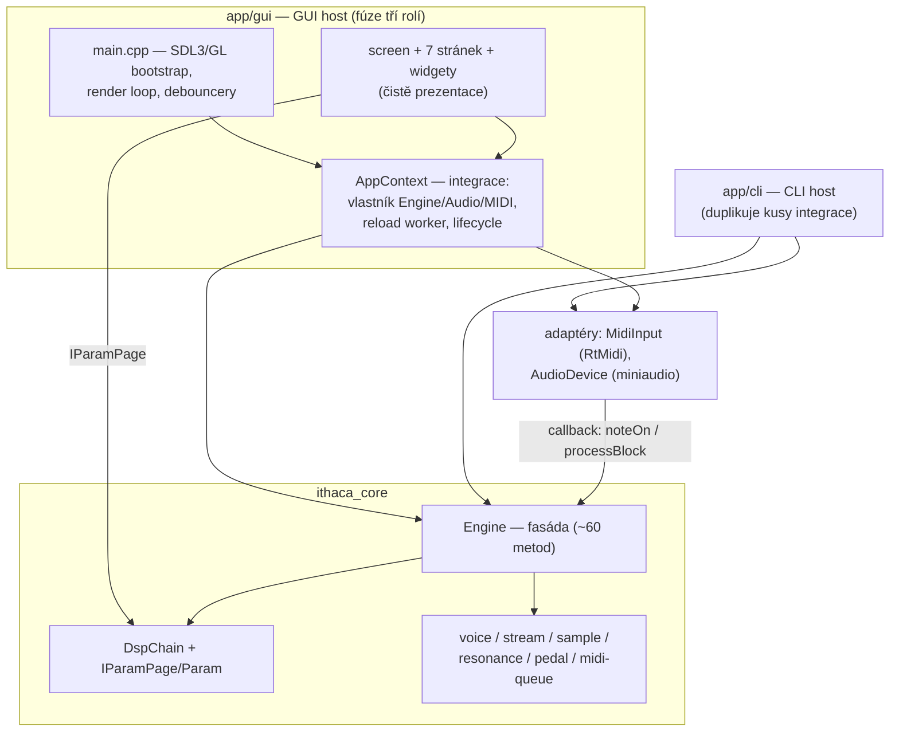

# Architektonická revize `ithaca-legacy`

Stav ke commitu `95b59d8`, branch `arch-review`. Revize vychází ze skutečných
include vztahů, volání a vlastnictví — ne z názvů adresářů. Naměřená data
(kompletní dependency graf, inventory, ownership, vlákna) jsou
v [docs/architecture/dependencies.md](docs/architecture/dependencies.md);
tento dokument hodnotí a navrhuje. Během revize nebyl proveden žádný
refactoring.

---

## 1. Executive summary

**Jak to dnes funguje.** Codebase má tři skutečné vrstvy: statickou knihovnu
`ithaca_core` (fasáda `Engine` + submoduly voice/stream/sample/resonance/dsp),
a dva hosty — `app/gui` (panel nástroje, SDL3 + ImGui) a `app/cli`. Hosty
závisí na core, core nezávisí na ničem z hostů. Audio běží na vlákně
miniaudia, MIDI na vlákně RtMidi, komunikace přes lock-free frontu a
single-writer atomiky; v audio cestě není jediný zámek.

**Co je dobré.** (a) Směr závislostí je správně: core je prokazatelně
použitelný bez GUI (CLI, offline render, 50 testů). (b) `IParamPage` +
`Param::id` je výborná abstrakce — jeden deskriptor parametru pohání GUI
rendering, persistenci, migrace i profily; přidání DSP parametru je změna
jednoho místa, doložená testem. (c) Threading je disciplinovaný a
zdokumentovaný přímo v kódu (quiesce handshake reloadu, pořadí
init/shutdown). (d) GUI logika je testovatelná bez okna (golden render testy).

**Největší problémy.** Žádný nález není kritický. Nejvýznamnější je, že
**zamýšlená Host/Integration vrstva neexistuje** — integrační know-how
(pořadí initu, audio/MIDI lifecycle, async reload) žije v `AppContext` uvnitř
`app/gui` a případný VST/JUCE host by ho musel opsat. Druhé v pořadí: fasáda
`Engine` je široká (~60 veřejných metod, GUI jich volá 35) a diagnostika je
rozprášená do ~17 getterů volaných po jednom každý frame.

**Doporučení (v pořadí):**

1. **Zavést diagnostický snapshot** (`Engine::diag()` vracející POD struct)
   místo 17 rozprášených getterů — zúží polovinu GUI↔Engine povrchu (F2).
2. **Smazat mrtvé API** `Engine::streamEngine()` (F5).
3. **Přesunout dva soubory**, které tvoří adresářové pseudo-cykly (F4).
4. **Neextrahovat host vrstvu teď** — ale přestat do `AppContext` přidávat
   vazby na `GuiState`, aby extrakce byla možná, až bude druhý host reálný (F1).
5. **DspChain nechat konkrétní** — pro embedded nástroj je pevný řetězec
   přednost, ne dluh (F3, hodnocení „v pořádku").

---

## 2. Current architecture

### Komponenty a odpovědnosti

| Komponenta | Odpovědnost | Klíčové soubory |
|---|---|---|
| **Engine (fasáda)** | lifecycle, MIDI vstupní API, `processBlock`, bank load/reload s quiesce handshakem, runtime settery, diagnostika | `engine/engine.{h,cpp}` (275 + 677 ř.) |
| **DSP chain** | pevný řetězec CONVOLVER→AGC→ENHANCER→LIMITER; `DspStage` (audio) a `IParamPage` (GUI-facing) rozhraní; `Param` deskriptory | `engine/dsp/` |
| **Player submoduly** | voice pool, streaming z disku (2 pooly), banka + `.ithaca` formát + crypto, sympatická rezonance, pedál | `engine/{voice,stream,sample,resonance,pedal}/` |
| **Adaptéry** | `MidiInput` (RtMidi→Engine), `AudioDevice` (miniaudio) | `engine/midi/midi_input.*`, `engine/io/audio_device.*` |
| **GUI host** | panel nástroje: 7 stránek, vizualizér, spořič, profily; **a zároveň** integrační vrstva (`AppContext`) a standalone host (`main.cpp`) | `app/gui/` |
| **CLI host** | `--play`, `--tone`, batch render, diagnostika | `app/cli/main.cpp` |

Engine **nedrží audio device** — to je vědomé rozhodnutí (`engine.h:126-128`):
hosty vlastní `AudioDevice` a předávají `processBlock` jako callback. Díky
tomu jde core použít offline (batch render, testy) beze změn.

### Zamýšlená vs. skutečná architektura

Zadání předpokládá čtyři vrstvy (Core / DSP / GUI / Host-Integration).
Skutečnost:

- **Core a DSP** existují a jsou oddělené správným směrem (Engine → DspChain;
  DSP nezná Engine).
- **GUI** existuje a s core mluví převážně přes rozhraní (`IParamPage`)
  a atomické gettery.
- **Host/Integration vrstva neexistuje.** `app/gui/main.cpp` je zároveň
  platformní bootstrap (SDL/GL) a `AppContext` zároveň integrační vrstva.
  `app/cli` si tutéž integraci (audio callback, MIDI open, RT priorita)
  implementuje podruhé. Žádná stopa po JUCE/VST v codebase není.

### Diagram skutečného stavu



---

## 3. Dependency analysis

Kompletní inventory (23 hran s typy a odkazy do kódu) je
v [dependencies.md](docs/architecture/dependencies.md#dependency-inventory).
Shrnutí hodnocení:

| From | To | Purpose | Assessment |
|---|---|---|---|
| app/gui, app/cli | `Engine` | lifecycle, parametry, diagnostika | **OK** — správný směr, fasáda |
| app/gui (page_params, dsp_state) | `IParamPage`/`Param` | generický render + persistence parametrů | **OK** — vzorová abstrakce |
| app/gui (`dsp_state.h`) | `DspChain` přes `engine.dspChain()` | zrcadlení stavu pro persistenci | **OK s výhradou** — druhá reprezentace parametrů, odůvodněná (debounce) |
| GUI stránky | 35 metod `Engine`, z toho ~17 diag getterů | čtení stavu každý frame | **Review** → F2 |
| `MidiInput` | `Engine` (runtime, forward-decl) | adaptér volá `noteOn/…` | **OK** — hlavičkově čisté |
| `Engine` | `DspChain` (konkrétní member) | post-mix DSP | **OK pro embedded** → F3 |
| `sample_store.cpp` | `resonance_layer_select.h` | čistá funkce | **Review** — umístění → F4 |
| kdokoliv (12 souborů) | `Logger::default_()` singleton | logování vč. RT | **OK s vědomím** → F6 |
| `Engine::streamEngine()` | — | žádný volající | **Odstranit** → F5 |
| hosty | SDL3/ImGui, miniaudio, RtMidi | platforma | **OK** — každá knihovna má právě jeden adaptér/místo |

Neočekávané směry: jediný je `MidiInput → Engine` (adaptér, v pořádku).
Skutečné cykly na úrovni souborů: **žádné**. Dva adresářové pseudo-cykly
(`engine⇄midi`, `sample⇄resonance`) jsou artefakt umístění souborů — detail
v dependencies.md.

---

## 4. Data flow

**Audio (RT cesta).** RtMidi thread → `MidiInput::callback` (filtr maskou
kanálů, atomic load) → `Engine::noteOn/…` → lock-free `MidiQueue`. Audio
thread v `processBlock`: drain fronty → voice + rezonance render (data ze
stream ringů plněných worker vlákny z disku) → `DspChain::process` → master
gain → scope ring + metry (single-writer atomiky). Hosty jen interleavují do
bufferu zařízení. Žádné kopírování navíc; scratch buffery jsou
předalokované.

**DSP parametry.** Jediný zdroj pravdy za běhu jsou atomiky uvnitř stage.
GUI je čte/zapisuje přes `IParamPage`; persistence si každý frame pořizuje
kopii do `GuiState::dsp` (`dspStateFromChain`, `app/gui/dsp_state.h`), protože
debounce porovnává celý `GuiState` hodnotově. Dvě reprezentace téže
informace — **opodstatněné**, náklad ~30 map-inzercí za frame je měřitelně
nulový. Třetí kopií je USER profil (sekce `defaults` v `state.json`) — jiná
role (snapshot, ne živý stav), v pořádku.

**Stav playeru → GUI.** ~17 atomických getterů + `scopeSnapshot` (kopie
1024 vzorků) + `BankLoadProgress` atomiky. Bez zámků; roztroušenost viz F2.

**Konfigurace a lifecycle.** `state.json` → `loadState` (sanitizace
file-úrovně) → `engineConfigFromState` (validace engine-úrovně, zápis
validovaných hodnot **zpět** do state) → `engine.init` →
`applyDspStateToChain` (nutně až po init, kvůli `choiceCount` Convolveru) →
audio → MIDI → async bank load. Pořadí je závazné a v kódu zdůvodněné —
je to nejcennější znalost zakódovaná v `AppContext`.

**Eventy.** Log: `Logger` → subscriber lambda (drží `this` AppContextu!) →
ring → GUI strip; RT zprávy přes RT ring + flush thread (10 ms). Reload:
worker → `reload_done_pending_.exchange` → `pollReloadCompletion` (přesně
jednou).

---

## 5. Findings

### F1 — Host/Integration vrstva neexistuje; integrace je vpletená do GUI hostu

**Finding:** Zamýšlená vrstva pro vícero host prostředí (VST/standalone)
v codebase není. Integrační know-how žije v `AppContext` (`app/gui/`):
závazné pořadí initu, audio/MIDI lifecycle, async reload worker, restart
zařízení při změně bufferu. `app/cli` si část téhož implementuje znovu.
`AppContext` navíc drží i čistě GUI věci (`PanelState`, `GuiState`).

**Location:** `app/gui/app_context.{h,cpp}` (celé), `app/cli/main.cpp`
(playAudioCb, MIDI open, RT setup).

**Why it matters:** Budoucí VST/JUCE host by musel opsat netriviální a snadno
rozbitnou orchestraci (pořadí initu je závazné; quiesce handshake reloadu má
přesné podmínky). Dnes jsou jediné dva hosty, takže to nebolí — ale každá
další vazba `AppContext` ↔ `GuiState` extrakci prodražuje.

**Impact:** Přidání hostu = kopírování logiky se skrytými invarianty; riziko
subtilních chyb (např. MIDI maska nastavená až po `open()`).

**Recommendation:** Teď **neextrahovat** (YAGNI — VST není v plánu potvrzen;
předpoklad, ne fakt). Ale držet disciplínu: do `AppContext` nepřidávat další
čtení/zápis `GuiState` mimo `initFromState`/profily; nové integrační chování
psát tak, aby nezáviselo na GUI typech. Až bude druhý host reálný, extrahovat
„Session" vrstvu (Engine + AudioDevice + MidiInput + reload worker, bez
`GuiState`/`PanelState`) — krok R4.

**Priority:** Medium (High v okamžiku, kdy padne rozhodnutí o VST).

### F2 — Široká fasáda: diagnostika rozprášená do ~17 getterů

**Finding:** `Engine` má ~60 veřejných metod; GUI jich používá 35, z toho
~17 čistě diagnostických (`activeVoices`, `masterPeakL/R`, `pedalCC`,
`dspLoadPeak`, `*RingsUsed/Total`, `*UnderrunRecent`, `noteOn/OffRecent`, …),
volaných jednotlivě každý frame z několika míst (`page_play.cpp:219-244`,
`screen.cpp`, `splash.cpp`, `page_bank.cpp`).

**Location:** `engine/engine.h:134-209`; konzumenti v `app/gui/`.

**Why it matters:** Povrch, který musí druhá strana znát, je zbytečně velký
a poroste (každý nový údaj = nový getter + nové volání v GUI). Hodnoty
čtené po jednom navíc nejsou vzájemně koherentní (každý load je jiný
okamžik) — pro diagnostiku to nevadí, ale je to další důvod, proč to
sjednotit.

**Impact:** Změna diagnostiky se dotýká obou stran; GUI zná 35 jmen místo
~18 + 1 struct.

**Recommendation:** Přidat `struct EngineDiag { … }` a `Engine::diag()`,
která naplní snapshot jedním voláním (uvnitř tytéž atomic loady). Gettery
zprvu ponechat (mechanická migrace GUI, pak smazat). Settery nechat, jak
jsou — jsou po jednom správně.

**Priority:** Medium.

### F3 — DspChain je konkrétní typ s pevnými čtyřmi stagi

**Finding:** `Engine` drží `dsp::DspChain dsp_` přímo (`engine.h:242`);
řetězec má natvrdo 4 stage ve třech místech jednoho souboru
(`dsp_chain.h`: members, pole `stages_[4]`, `stageCount() { return 4; }`).

**Location:** `engine/dsp/dsp_chain.h`, `engine/engine.h:242`.

**Why it matters / Impact:** Výměna DSP implementace nebo přidání stage =
edit `dsp_chain.h` (jedno místo, tři řádky). Vše ostatní (GUI, persistence,
profily) se přizpůsobí samo díky `IParamPage`/`Param::id` — doloženo testy
s fiktivní stránkou i „zcela_novy_param".

**Recommendation:** **Ponechat.** Pro embedded nástroj s pevným zvukovým
řetězcem je konkrétní typ výhoda (žádné alokace, inlining, přehlednost).
Jediné mikro-zlepšení: `stageCount()` vracet `IM_ARRAYSIZE`-ekvivalent
z pole místo literálu `4`, ať přidání stage = 2 místa místo 3 (krok R5,
volitelný).

**Priority:** Low (vědomě „v pořádku").

### F4 — Adresářové pseudo-cykly `engine⇄midi` a `sample⇄resonance`

**Finding:** Na úrovni adresářů vycházejí dva cykly; na úrovni souborů
žádný není. (1) `midi/` míchá datové struktury core (`midi_queue.h`,
`note_hold.h` — includuje je `engine.h`) s RtMidi adaptérem
(`midi_input.cpp` → `engine.h`). (2) `nearestSlotByRms` — čistá funkce nad
typy ze `sample/` — leží v `resonance/`, ale volá ji `sample_store.cpp:6`.

**Location:** `engine/midi/*`, `engine/resonance/resonance_layer_select.h`,
`engine/sample/sample_store.cpp:6`.

**Why it matters:** Mapa závislostí lže na první pohled („midi závisí na
engine a engine na midi"); nováček musí číst soubory, aby zjistil, že je to
neškodné. Nástroje na kontrolu vrstev (kdyby se kdy zavedly) by tu falešně
křičely.

**Impact:** Nulový runtime dopad; jen srozumitelnost a budoucí lint.

**Recommendation:** Přesunout `resonance_layer_select.{h,cpp}` do
`engine/sample/` (jeho typy tam žijí). U `midi/` buď nic (stačí komentář
v dependencies.md — už je), nebo rozdělit na `midi/` (queue, hold) a
adaptér přesunout k `io/` vedle `AudioDevice`, kde už adaptéry žijí.

**Priority:** Low.

### F5 — Mrtvé veřejné API

**Finding:** `Engine::streamEngine()` (`engine.h:132`) nemá jediného
volajícího; vrací ukazatel na interní `StreamEngine` (leak implementace).
Komentář říká „potřeba pro inspect / diag / GUI" — diagnostika dnes jde
přes dedikované gettery (`mainRingsUsed()` atd.).

**Location:** `engine/engine.h:132`.

**Why it matters / Impact:** Zve budoucí kód k obcházení fasády; nulová
cena odstranění.

**Recommendation:** Smazat (krok R1).

**Priority:** Low.

### F6 — Logger singleton

**Finding:** `log::Logger::default_()` je jediný skutečný globální mutable
stav (12 souborů). Subscriber lambda drží `this` AppContextu — lifetime
závislost řešená ručně (`shutdown()` → `clearSubscribers`, `app_context.cpp:170`).

**Location:** `engine/util/log.h`, `app/gui/app_context.cpp:52,170`.

**Why it matters:** Globál je pro RT logging pragmatický (nelze protahovat
referenci audio cestou); ruční lifetime je ale past — kdyby vznikl druhý
subscriber s kratším životem, není nic, co by ho ohlídalo.

**Impact:** Dnes bezpečné (jediný subscriber, pořadí zdokumentované).

**Recommendation:** Ponechat; jen kdyby přibývali subscribeři, přejít na
tokeny/`weak_ptr`. Nezavádět DI kvůli loggeru — přidalo by to šum do všech
podpisů bez reálného zisku.

**Priority:** Low.

### F7 — Dvě reprezentace DSP parametrů (chain ↔ `GuiState::dsp`)

**Finding:** Živý stav v atomikách stage vs. hodnotová kopie
v `GuiState::dsp`, zrcadlená každý frame.

**Location:** `app/gui/dsp_state.h:89` (`dspStateFromChain` per frame,
volá `main.cpp` render loop).

**Why it matters:** Duplicitní reprezentace je obvykle zdroj rozjetí — tady
je ale jednosměrně generovaná z jediného zdroje pravdy přes stabilní klíče
(`Param::id`), takže rozjet se nemůže.

**Impact / Recommendation:** Náklad neměřitelný, mechanismus testovaný.
**Ponechat**; alternativa (dirty-flag místo per-frame kopie) by ušetřila
mikrosekundy za cenu nového stavového příznaku.

**Priority:** Low (vědomě „v pořádku").

### F8 — Silné stránky, které při refactoringu nerozbít

Ne nález, ale závazek: (a) quiesce handshake reloadu přes `block_epoch_`
(`engine.h:81-93`) — jediné místo, kde se smí mutovat banka; (b) závazné
pořadí init/shutdown v `AppContext`; (c) `IParamPage`/`Param::id` jako
jediný mechanismus parametrů — **žádná nová cesta k parametrům se nesmí
zavést mimo něj**; (d) zero-lock audio cesta; (e) testovatelnost GUI bez
okna (golden testy linkují GUI zdrojáky přímo, `tests/CMakeLists.txt:233`).

---

## 6. DRY / duplication findings

| Duplicita | Kde | Verdikt |
|---|---|---|
| Audio callback (interleave + scratch) | `app_context.cpp:23` vs `cli/main.cpp` playAudioCb | **Ponechat záměrně** — 14 řádků, komentované zrcadlo; sjednotí se přirozeně až se Session vrstvou (R4). Abstrakce dnes = vazba CLI na GUI kód nebo nový sdílený modul kvůli 14 řádkům. |
| MIDI open + maska-před-open + RT priorita setup | `app_context.cpp:89-108` vs `cli/main.cpp` | **Ponechat, ale hlídat** — invariant „maska před open" je na dvou místech; patří do R4. Do té doby aspoň komentář-křížový odkaz (už existuje). |
| Clamp hodnot v `IParamPage::set` | každá stage + `master_page.h:21`, `resonance_page.h:43-49` | **Ponechat** — kontrakt říká „set() klampuje", implementace je na každé stránce triviální; centralizace by vyžadovala CRTP/wrapper za tři řádky. |
| Sanitizace persistence vs validace `state_binding` | `persistence.cpp` (file-level) vs `state_binding.h` (engine-level) | **Není duplicita** — dvě různé odpovědnosti (poškozený soubor vs. smysluplná konfigurace engine), každá s vlastními testy. Explicitně ponechat oddělené. |
| Řádkové sazeče GUI | sjednoceno do `layout::splitRow` + `wdg::chipRow*` | **Vyřešeno dříve** — pozitivní vzor, nové řádky používat tudy. |
| `holdMax`/`holdLast` | `page_play.cpp` | **Ponechat** — lokální, 8 řádků, jasné. |

Obecně: codebase je na duplicitu skoupá; oba reálné případy jsou vědomé
zrcadlení mezi hosty, které zmizí s R4. Nic k mechanickému sjednocování.

---

## 7. Proposed architecture

Nejmenší změna s největším ziskem — žádná nová vrstva „do zásoby":

```text
DNES                                   CÍL (po R1–R3, beze změny vrstev)

app/gui ──┐                            app/gui ──┐
          ├─► Engine (60 metod,                  ├─► Engine (štíhlejší:
app/cli ──┘    17 diag getterů,        app/cli ──┘    diag() snapshot,
               streamEngine())                        bez mrtvého API)
               │                                      │
               ▼                                      ▼
           DspChain ◄── IParamPage ── GUI         DspChain ◄── IParamPage ── GUI
                                                  (beze změny — funguje)

AŽ BUDE DRUHÝ HOST REÁLNÝ (R4):

   app/gui (panel)    app/cli    [VST host]
        │  jen prezentace │          │
        ▼                 ▼          ▼
   ┌──────────────────────────────────────┐
   │ Session (dnes AppContext bez GuiState):
   │ Engine + AudioDevice + MidiInput +
   │ reload worker + pořadí lifecycle     │
   └──────────────────┬───────────────────┘
                      ▼
                   Engine → DspChain, submoduly
```

Co se **nemění**: `IParamPage` jako jediný parametrický mechanismus,
konkrétní `DspChain`, vlastnictví audio device hostem, Logger singleton,
lock-free komunikační vzory.

---

## 8. Recommended refactoring plan

Kroky jsou malé, nezávisle reviewovatelné, každý s plnou testovací sadou.
R1–R3 lze provést kdykoli; R4 je **podmíněný** rozhodnutím o druhém hostu.

**R1 — smazat mrtvé API** (`Engine::streamEngine()`, `engine.h:132`)
*Co:* odstranit getter. *Proč:* leak implementace bez volajícího (F5).
*Závisí na:* ničem. *Riziko:* žádné (kompilátor by odhalil volajícího).

**R2 — `EngineDiag` snapshot** (F2)
*Co:* POD struct + `Engine::diag()`; migrace GUI čtení (`page_play`,
`screen`, `splash`, `page_bank`) na jeden snapshot per frame; poté smazat
osiřelé gettery. *Proč:* zúžení fasády ~o polovinu čtecího povrchu, jedno
místo pro budoucí diagnostiku. *Závisí na:* ničem. *Riziko:* nízké —
mechanická náhrada, chování stejné; hlídat jen to, že snapshot se pořizuje
jednou za frame, ne per widget. *Test:* stávající golden render testy +
kompilace.

**R3 — přesuny souborů kvůli mapě** (F4)
*Co:* `resonance_layer_select.{h,cpp}` → `engine/sample/`; volitelně
`midi_input.*` → k adaptérům (`engine/io/` nebo `engine/midi/input/`).
*Proč:* zrušit adresářové pseudo-cykly, mapa přestane vyžadovat vysvětlivky.
*Závisí na:* ničem. *Riziko:* žádné (přesun + úprava include cest); po kroku
přegenerovat dependencies.md.

**R4 — extrakce Session vrstvy** (F1) — **až bude druhý host reálný**
*Co:* z `AppContext` vydělit host-neutrální část (Engine + AudioDevice +
MidiInput + reload worker + lifecycle pořadí) bez `GuiState`/`PanelState`;
GUI si ponechá tenký `AppContext` nad Session; CLI přejde na Session
(zmizí obě záměrné duplicity z kap. 6). *Proč:* jediná cesta, jak přidat
VST host bez opisování invariantů. *Závisí na:* R2 (menší povrch = menší
Session API); rozhodnutí o VST. *Riziko:* střední — dotýká se pořadí
lifecycle; mitigace: přesouvat beze změn chování, pořadí zafixovat testem
(dnes je jen v komentářích).

**R5 — volitelné drobnosti**
`DspChain::stageCount()` z pole místo literálu (F3); u Loggeru nic, jen
pravidlo pro nové subscribery (F6).

Po každém kroku: aktualizovat
[dependencies.md](docs/architecture/dependencies.md) a zapsat diff proti
baseline (které hrany zanikly/vznikly, změna počtu veřejných metod fasády).

---

*Předpoklady označené v textu: plán VST/JUCE hostu není v repozitáři nikde
potvrzen — F1/R4 s ním pracují jako s možností, ne faktem. Vše ostatní je
doloženo odkazem do kódu.*
