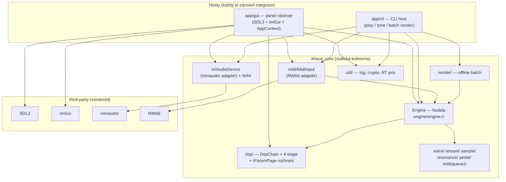
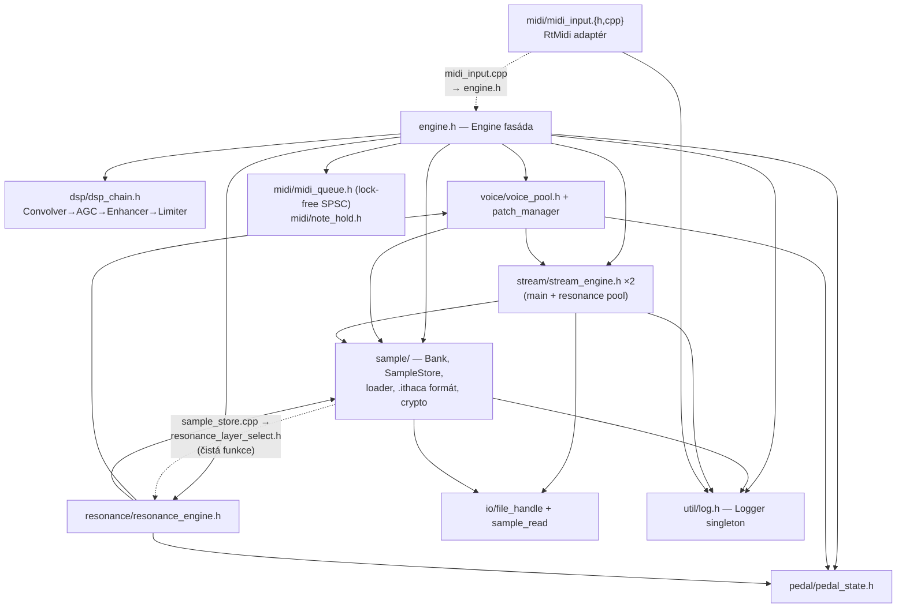
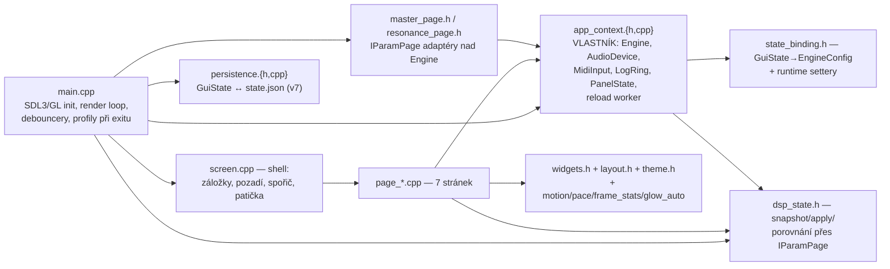

# Dependency map — baseline

Zmapování skutečných závislostí v codebase `ithaca-legacy` ke commitu `95b59d8`
(branch `arch-review`). Tohle je **výchozí stav před případným refactoringem**:
po každé architektonické změně se má tento dokument aktualizovat a rozdíl
proti baseline explicitně popsat (viz [poslední kapitola](#jak-delat-diff-po-refactoringu)).

Mapa vychází z **reálných `#include` vztahů, volání a vlastnictví objektů**,
ne z adresářové struktury ani ze zamýšlené architektury. Kde se záměr
a skutečnost liší, je to uvedeno. Hodnocení jednotlivých závislostí a nálezy
jsou v [ARCHITECTURE_REVIEW.md](../../ARCHITECTURE_REVIEW.md) — tento dokument
je popisný.

Rozlišované typy závislostí:

| Typ | Význam |
|---|---|
| **compile** | `#include` / linkování — bez cíle se zdroj nepřeloží |
| **runtime** | objekt potřebuje instanci cíle za běhu (ukazatel, referenci) |
| **data** | komponenta konzumuje data vytvořená jinou komponentou |
| **control** | komponenta řídí lifecycle nebo chování cíle (start/stop, vlákna) |

---

## High-level diagram

Skutečné vrstvy jsou tři, ne čtyři: **samostatná host/integration vrstva
neexistuje**. Roli hostu plní přímo dvě aplikace (`app/gui`, `app/cli`)
a integrační logika GUI hostu žije v `AppContext` uvnitř `app/gui`.



Směr závislostí je zdravý: hosty → core, core → nic z hostů. Jediná šipka
„proti proudu" je `MidiInput → Engine` (adaptér volá `noteOn`/`noteOff`
na engine, kterému byl předán) — detail níže v [cyklech](#circular-dependencies).

## Detailní diagram — uvnitř ithaca_core



Tečkované šipky jsou dvě „nečekané" hrany rozebrané v kapitole o cyklech.

## Detailní diagram — app/gui



`app/gui` nemá vlastní knihovnu — je to entry-point binárka; testy linkují
tytéž zdrojáky přímo (`tests/CMakeLists.txt:233`, golden render test).

---

## Vrstvy a odpovědnosti

| Modul | Odpovědnost | Poznámka |
|---|---|---|
| `engine/engine.{h,cpp}` | Fasáda: lifecycle, MIDI vstupní API, `processBlock`, diagnostika, runtime settery | jediný vstupní bod pro hosty; ~60 veřejných metod |
| `engine/dsp/` | `DspChain` (pevné pořadí 4 stage), `DspStage`/`IParamPage` rozhraní, `Param` deskriptory | `IParamPage` je **klíčová abstrakce** — pohání GUI rendering, persistenci i profily |
| `engine/voice/` | Voice pool, výběr patche, render hlasů | |
| `engine/stream/` | Streaming vzorků z disku (ring buffery, worker vlákna) | dva instance: main + rezonance |
| `engine/sample/` | Bank, loader, `.ithaca` formát, šifrování, RAM budget | `BankLoadProgress` atomiky = progress kanál pro GUI |
| `engine/resonance/` | Sympatická rezonance (vlastní voices + cache) | |
| `engine/midi/` | **Dvě role:** `midi_queue`/`note_hold` (datové struktury core) a `MidiInput` (RtMidi adaptér) | viz cykly |
| `engine/pedal/` | Stav sustain pedálu | |
| `engine/io/` | `AudioDevice` (miniaudio adaptér), WAV I/O, file handle | |
| `engine/render/` | Offline batch render (bez audio device) | používá jen CLI a smoke test |
| `engine/util/` | Logger (singleton), crypto, SHA-256, RT priorita, sysinfo | |
| `app/gui/` | Panel nástroje **a zároveň** standalone host + integrační vrstva (`AppContext`) | |
| `app/cli/` | CLI host: `--play`, `--tone`, batch render, diagnostika | |

---

## Dependency inventory

Nejvýznamnější závislosti; sloupec Kde odkazuje na reprezentativní místo.

| # | Source | Target | Typ | Mechanismus | Účel | Kde | Hodnocení |
|---|---|---|---|---|---|---|---|
| 1 | `app/gui/AppContext` | `Engine` | compile+runtime+control | member (vlastník), přímá volání | lifecycle, parametry, reload | `app_context.h`, `app_context.cpp:40` | OK — fasáda |
| 2 | `app/gui/page_*` | `Engine` | runtime+data | `ctx.engine.<getter/setter>` (35 metod) | diagnostika + runtime parametry | `page_play.cpp:219-244` | Review — šířka povrchu (nález F2) |
| 3 | `app/gui` | `dsp::IParamPage`, `Param` | compile | interface + deskriptory | generický render/persistence/profily parametrů | `page_params.cpp`, `dsp_state.h` | OK — tohle je zamýšlené API |
| 4 | `app/gui/dsp_state.h` | `dsp::DspChain` | compile+data | `engine.dspChain()` → iterace stage | zrcadlení chain ↔ `GuiState::dsp` (každý frame) | `dsp_state.h:89`, `engine.h:212` | OK s výhradou — GUI drží druhou reprezentaci parametrů (záměrné, kvůli debounce) |
| 5 | `app/gui/master_page.h`, `resonance_page.h` | `dsp::IParamPage` | compile (implementace) | GUI **implementuje** rozhraní definované v DSP vrstvě | MASTER/RESO stránky jedou stejným generickým mechanismem | `master_page.h:10` | OK — elegantní inverze |
| 6 | `app/gui/AppContext` | `AudioDevice` | control | `start(cb, &engine, …)`/`stop` | audio lifecycle, změna bufferu | `app_context.cpp:79,173` | OK |
| 7 | `app/gui/page_sys` | `MidiInput` | runtime+control | `ctx.midi.open/close/setChannelMask` | výběr portu a kanálů za běhu | `page_sys.cpp:129-139` | OK — mediace přes AppContext member |
| 8 | `app/cli` | `Engine`, `BatchRenderer`, `AudioDevice`, `MidiInput` | compile+runtime+control | přímá volání | druhý host | `app/cli/main.cpp:10-16` | OK |
| 9 | `Engine` | `DspChain` | compile+runtime | member `dsp_` (konkrétní typ) | post-mix DSP v `processBlock` | `engine.h:242` | OK pro embedded; výměna implementace = edit `dsp_chain.h` (nález F3) |
| 10 | `Engine` | voice/stream/sample/resonance/pedal | compile+runtime+control | members + `unique_ptr` | kompozice playeru | `engine.h:229-240` | OK |
| 11 | `MidiInput` | `Engine` | runtime | `Engine*` předaný v `open()`; callback volá `noteOn/noteOff/sustainPedal` | překlad RtMidi → engine API | `midi_input.cpp:7`, `midi_input.h:83` | OK — adaptér; hlavičkově jen forward-decl (`midi_input.h:25`) |
| 12 | `Engine` | `midi_queue.h`, `note_hold.h` | compile | members | lock-free MIDI fronta + cross-channel hold | `engine.h:13-14,235-236` | OK — samostatné datové struktury bez závislostí |
| 13 | `sample_store.cpp` | `resonance/resonance_layer_select.h` | compile | volání čisté funkce `nearestSlotByRms` | výběr velocity vrstvy při plnění rezonanční cache | `sample_store.cpp:6` | Review — umístění souboru tvoří adresářový pseudo-cyklus (nález F4) |
| 14 | `resonance/*` | `sample/sample_types.h` | compile | typy `NoteSlots` apod. | sdílené datové typy | `resonance_layer_select.h:6` | OK |
| 15 | audio thread (miniaudio) | `Engine::processBlock` | control+data | callback `audioCallback(userdata=Engine*)` | render audia | `app_context.cpp:23`, `cli/main.cpp` (playAudioCb) | OK — vzor záměrně zdvojen v obou hostech |
| 16 | GUI ← `Engine` | diagnostické atomiky | data | ~17 getterů (peak, scope ring, ringy, load, epochy) | čtení stavu bez zámků | `engine.h:134-209` | OK mechanicky; roztroušenost viz F2 |
| 17 | loader worker | `BankLoadProgress` | data | atomiky plněné loaderem, čtené GUI overlay/splash | průběh načítání | `engine.h:80`, `app_context.cpp:123` | OK — vlastní ho caller (AppContext) |
| 18 | kdokoliv | `log::Logger::default_()` | runtime (globál) | singleton, 12 souborů | logování vč. RT ringu | `util/log.h` | OK s vědomím — jediný skutečný globální mutable stav; lifetime subscriberů řeší `shutdown()` (`app_context.cpp:170`) |
| 19 | `app/gui` | SDL3, ImGui, GL | compile+runtime | okno, vstup, kreslení | platformní vrstva panelu | `main.cpp`, CMake:216-257 | OK — izolováno v `main.cpp` + backendy |
| 20 | `io/AudioDevice` | miniaudio | compile | adaptér | výstupní zařízení | `audio_device.cpp` | OK — jediné místo, kde se miniaudio API používá |
| 21 | `midi/MidiInput` | RtMidi | compile | adaptér | vstupní MIDI porty | `midi_input.cpp:10` | OK — jediné místo |
| 22 | `sample/` | `bank_secret_generated.h` | compile (generovaný) | build-time tajemství | šifrované banky | CMake custom command | OK |
| 23 | `Engine::streamEngine()` | — | — | veřejný getter **bez volajícího** | historický diag přístup | `engine.h:132` | Odstranit (nález F5) |

## Callbacky a event vazby

| Vazba | Vlákno původu | Mechanismus | Data |
|---|---|---|---|
| miniaudio → `audioCallback` → `processBlock` | audio (miniaudio) | C callback + `void* userdata` | interleaved float buffer |
| RtMidi → `MidiInput::callback` → `Engine::noteOn/…` | RtMidi thread | C callback + `void* userdata`; maska kanálů atomicky | MIDI zprávy → `MidiQueue` (lock-free push) |
| Logger → subscriber → `LogRingBuffer` | libovolné (RT přes ring) | `std::function` subscriber; lambda drží `this` AppContextu | `LogEntry` |
| loader → GUI overlay | reload worker | `BankLoadProgress` atomiky (fáze/done/total/bytes/flagy) | průběh |
| reload dokončení → GUI | reload worker → GUI | `reload_done_pending_.exchange` v `pollReloadCompletion` (přesně jednou) | výsledek + truncated/license flagy |

## Ownership a lifecycle

Strom vlastnictví (kdo koho vytváří a ničí):

```text
main() [app/gui/main.cpp]
└── AppContext                        (stack, žije celý běh)
    ├── Engine                        (member)
    │   ├── DspChain (member) → 4 stage (members)
    │   ├── VoicePool, StreamEngine ×2, ResonanceEngine (unique_ptr)
    │   ├── MidiQueue, NoteHoldTracker, PedalState, Bank (members)
    │   └── recache_thread_           (vlastní, join v destruktoru/reloadu)
    ├── AudioDevice (unique_ptr)      → vlastní miniaudio device + audio thread
    ├── MidiInput (member)            → vlastní RtMidiIn + jeho thread
    ├── LogRingBuffer (member)        ← subscriber lambda drží `this`!
    ├── PanelState (member)           — veškerý mezisnímkový stav GUI
    ├── GuiState state (member)       — persistovaný stav (vlastník: GUI)
    └── reload_thread_                (worker; join v shutdown)
```

Pořadí initu (`app_context.cpp:40`) a shutdownu (`:160`) je **závazné**
a zdokumentované přímo v kódu: severity → subscriber → `engine.init` →
`applyDspStateToChain` (až po init kvůli `choiceCount`) → audio start →
MIDI open (maska před open) → async bank load. Shutdown pozpátku: join
reload → MIDI close → audio stop → clear subscribers.

Kdo smí co měnit:

| Data | Zapisuje | Čte | Mechanismus |
|---|---|---|---|
| DSP parametry stage | GUI thread (`IParamPage::set`) | audio thread (`process`) | atomiky uvnitř stage |
| `GuiState` | GUI thread | GUI thread | jediné vlákno; debounce porovnává celek |
| `GuiState::dsp` zrcadlo | GUI thread (`dspStateFromChain`, každý frame) | persistence | data-kopie chainu |
| scope ring, metry, epochy | audio thread | GUI thread | single-writer atomiky, bez zámků |
| `MidiQueue` | MIDI/GUI thread (push) | audio thread (drain) | lock-free SPSC |
| maska MIDI kanálů | GUI thread | RtMidi thread | `atomic<uint16_t>` |
| Bank | reload worker (za `bank_loading_` + quiesce handshake) | audio thread | epoch handshake `waitForAudioQuiesce` |
| rezonanční cache | recache thread (mutex `recache_mtx_`) | audio thread | fade + ready flag |

## Globální a sdílený stav

| Globál | Kde | Rozsah | Hodnocení |
|---|---|---|---|
| `log::Logger::default_()` | `util/log.h` | celý proces (12 souborů) | jediný skutečný singleton; RT-safe ring, pragmatické |
| `layout::g_scale` | `app/gui/layout.h:20` | GUI; čte jen rasterizace fontů | OK, zdokumentované |
| `theme::Fonts::*` | `app/gui/theme.h` | GUI; statické `ImFont*` | OK — ImGui vlastní data |
| scratch buffery v `audioCallback` | `app_context.cpp:27` | audio thread | OK — jediný konzument |

## Circular dependencies

**Na úrovni souborů žádný cyklus neexistuje.** Na úrovni adresářů vycházejí
dva, oba jako artefakt umístění souborů, ne skutečné obousměrné vazby:

1. **`engine` ⇄ `engine/midi`**
   `engine.h` → `midi/midi_queue.h`, `midi/note_hold.h` (datové struktury,
   samy nezávisí na ničem) a současně `midi/midi_input.cpp` → `engine.h`
   (adaptér volá engine). Adresář `midi/` tedy míchá dvě role: *vlastnictví
   core* (fronta, hold tracker) a *vstupní adaptér* (RtMidi). Hlavičkově je
   to čisté (`midi_input.h` má jen `class Engine;` forward-decl).

2. **`engine/sample` ⇄ `engine/resonance`**
   `resonance/*` → `sample/sample_types.h` (sdílené typy — správný směr)
   a současně `sample/sample_store.cpp` → `resonance/resonance_layer_select.h`
   (čistá funkce `nearestSlotByRms` nad typy ze `sample/`). Funkce sedí
   v adresáři, jehož typy nepoužívá nic rezonančního — patřila by spíš
   k `sample/`.

Obojí je kosmetika s nulovým rizikem — viz kroky R3 v refactoring plánu.

## Známá odchylka záměru od skutečnosti

Zadání revize předpokládá čtyři vrstvy včetně **Host/Integration layer**
(VST/JUCE, standalone, …). Ta v codebase **neexistuje**: žádný JUCE/VST
target není a integrační logika (pořadí initu, audio/MIDI lifecycle, async
reload, restart bufferu) žije v `AppContext` uvnitř `app/gui`, částečně
zduplikovaná v `app/cli`. Rozbor a doporučení: nález F1 v ARCHITECTURE_REVIEW.

## Jak dělat diff po refactoringu

Po každé architektonické změně:

1. Přegeneruj modulový graf (skript níže) a porovnej s tímto dokumentem.
2. Do ARCHITECTURE_REVIEW (nebo commit message) uveď: které hrany zanikly /
   vznikly / změnily směr, které cykly zmizely, jak se změnil počet
   veřejných metod fasády.
3. Aktualizuj tento soubor — diagramy, inventory (čísla řádků!), ownership.

Modulový graf se získá jednoduše: pro každý `.h/.cpp` v `engine/` a `app/`
vytáhni `#include "…"`, přiřaď soubor k modulu podle adresáře
(`app/gui`, `app/cli`, `engine`, `engine/<podadresář>`) a vypiš hrany mezi
moduly. Přesně tak vznikla tato baseline.
