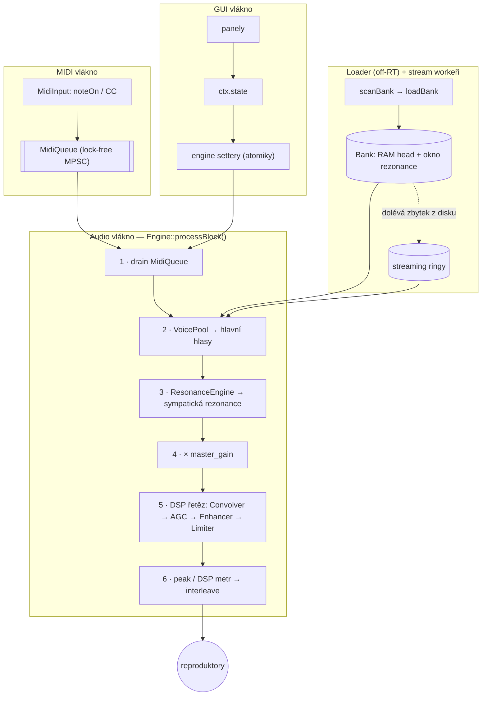

# 1 · Co je ithaca a jak přemýšlí

ithaca-legacy je **nízkolatenční přehrávač vlastních vzorkových bank**. Vezme
nahrávky skutečného nástroje — typicky klavíru — a hraje je výrazově: reaguje na
sílu úhozu, na pedál, nechává struny vzájemně rezonovat a zvládne i banku, která
se nevejde do paměti. Jedním z cílů je, aby celé jádro běželo i na Raspberry Pi 5
a streamovalo vzorky z disku za běhu.

Není to syntezátor. ithaca **nepočítá tón vzorcem** — přehrává to, co někdo
nahrál. Tím se liší od sesterského projektu *icr2*, který banky aditivně
syntetizuje. ithaca je strana spotřebitele: dostane hotovou banku (ať už
nahranou z reálného piana, nebo vygenerovanou) a její starostí je proměnit ji
v živý, hratelný nástroj s co nejmenší latencí.

Tahle knížka popisuje, **jak to funguje** — od provozu (build, Raspberry Pi,
konfigurace, formát banky) až po vnitřek enginu (jak teče signál, jak se sdílí
data mezi vlákny, jak je postavený DSP řetěz). Začneme tím nejdůležitějším:
cestou jednoho tónu od stisku klávesy ke zvuku.

## Cesta jednoho tónu

Když stisknete klávesu, událost neproletí enginem rovnou. Nejdřív přistane v
**lock-free frontě** (MIDI vlákno nesmí blokovat audio vlákno), odkud si ji audio
vlákno vyzvedne na začátku svého bloku. Teprve tam se z noty stane hlas, hlas
rozezní příslušný vzorek, k němu se přidá **sympatická rezonance** ostatních
strun, vše projde **DSP řetězem** a výsledek se pošle na zvukovou kartu. Mezitím,
úplně stranou, **loader** drží v paměti začátky vzorků a **stream workeři**
dolévají jejich zbytek z disku.

Klíčová zásada, která se prolíná celým enginem: **audio vlákno nikdy nečeká.**
Nealokuje paměť, nebere zámky, nesahá na disk. Všechno pomalé (načítání banky,
čtení z disku, kreslení GUI) se děje jinde a s audio vláknem komunikuje přes
atomiky a lock-free fronty. Tahle disciplína je důvod, proč engine zvládá nízkou
latenci i na slabém hardwaru — a vrací se k ní celá [Část II](../reference/00-overview.md).

## Co dělá přehrávání živým

Pár vlastností odlišuje ithacu od „prostě přehraj WAV":

- **Dynamické velocity vrstvy.** Pro každou notu existuje víc nahrávek o různé
  síle úhozu. Engine je nevybírá podle názvu souboru, ale podle **naměřeného
  peak RMS** — seřadí je od nejtišší po nejhlasitější a namapuje na rozsah
  0–127. Banka tak může mít u každé noty jiný počet vrstev a pořád to sedí.
- **Round-robin.** Opakovaný úhoz téže noty může sáhnout po jiném take, aby
  nevznikal „kulometný" efekt identického vzorku. *(Výběr hotový, shlukování
  variant je [plánované](../plan2do.md#a2-round-robin-clustering).)*
- **Sympatická rezonance.** Když držíte tón nebo pedál, ostatní struny se
  rozeznívají podle shody harmonických — ne efektem, ale modelem partiálové
  koincidence. Detaily v [kapitole E](../reference/E-resonance.md).
- **Half-pedaling.** Pedál není jen zap/vyp; engine sleduje jeho průběžnou
  polohu a podle ní řídí tlumení.
- **Streaming z disku.** Velké banky se nenačítají celé do RAM — v paměti je jen
  začátek (head) každého vzorku a okno pro rezonanci, zbytek se dolévá za běhu.
  Proto banka může být klidně větší než paměť stroje.

## Dvě tváře aplikace a dvě podoby banky

Engine `libithaca_core` je headless knihovna; používají ho dva konzumenti:

- **`ithaca-cli`** — dávkové renderování banky do WAV (smoke test, offline).
- **`ithaca-gui`** — čelní panel nástroje (Dear ImGui + GLFW) pro hraní naživo,
  s asynchronním načítáním banky a perzistencí nastavení do `state.json`.

Banka existuje ve dvou podobách: jako **adresář** WAV souborů (čitelný,
editovatelný — formát *fixed-velocity* nebo *dynamic-velocity*), nebo jako jeden
**pakovaný soubor** `soundbank.ithaca`, který může být navíc **šifrovaný a
licencovaný**. Obojí pokrývá [kapitola o formátu banky](05-format-banky.md).

## Kudy dál

| Chci… | Jdi na |
|-------|--------|
| postavit projekt | [2 · Build a Makefile](02-build-makefile.md) |
| rozjet to na Raspberry Pi 5 | [3 · Raspberry Pi 5](03-raspberry-pi-5.md) |
| nastavit GUI / `state.json` | [4 · Konfigurace](04-konfigurace.md) |
| pochopit formát banky | [5 · Formát banky](05-format-banky.md) |
| nahlédnout do enginu | [Část II — reference](../reference/00-overview.md) |
| vědět, co se chystá | [Plán a nedodělky](../plan2do.md) |
