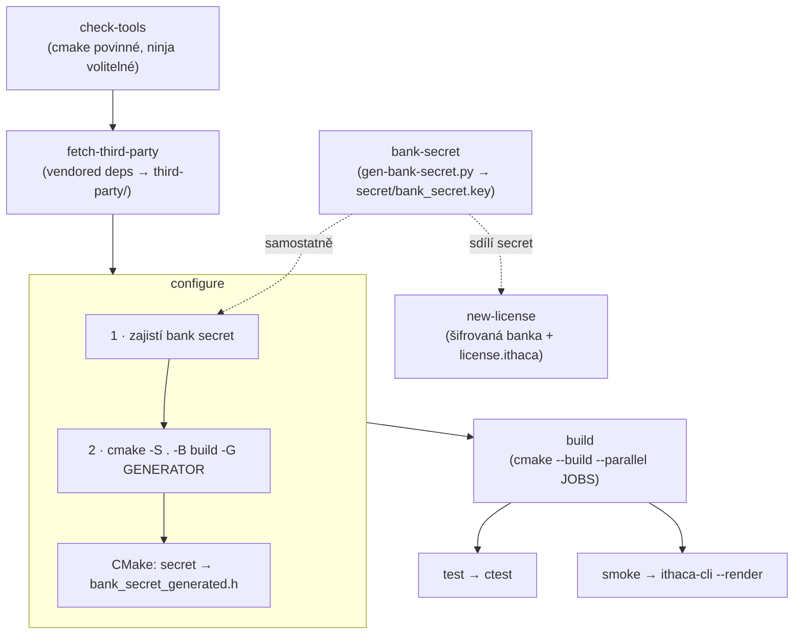

# 2 · Build a Makefile

Postavit ithacu znamená v praxi napsat dva příkazy. Za tou jednoduchostí ale
stojí rozhodnutí, které se vyplatí znát: **kořenový `Makefile` sám nic
nekompiluje.** Je to tenký orchestrator nad CMake — vrstva, která se za vás
rozhodne, jakou platformu máte, jaký generátor je po ruce a kolik jader smí
zapřáhnout, a pak zavolá CMake se správnými argumenty. Veškerou skutečnou práci
(překlad, linkování, stažení vendored deps) dělá CMake.

Proč ta mezivrstva existuje? Protože „správné" volání CMake vypadá na každém
stroji jinak. Na Macu chcete Ninju, pokud je nainstalovaná, jinak Unix
Makefiles. Na čistém Windows ani jedno — tam je rozumný default `Visual Studio
17 2022`, protože Unix Makefiles by hledaly `gcc`, které s MSVC toolchainem
nemáte. Počet jader se zjišťuje přes `sysctl` (macOS) nebo `nproc` (Linux). To
všechno by si jinak musel pamatovat člověk; `Makefile` to dělá za něj a vždycky
stejně.

## Rychlý start

```sh
make fetch-third-party   # jednou po čerstvém klonu: stáhne vendored deps
make build               # zkompiluje vše (configure si vyžádá sám, pokud chybí)
```

A když si nejste jistí, co dál: `make` bez argumentu (nebo `make help`) je
výchozí cíl. Vypíše detekovanou platformu, generátor a počet jader, k tomu
**seznam všech cílů** a override proměnné. Ten seznam se generuje automaticky
z anotací přímo v `Makefile`, takže se nemůže rozejít s realitou.

```sh
make                              # nápověda (výchozí cíl)
make test                         # build + doctest přes ctest
make smoke                        # build + rychlý batch-render self-test
make rebuild                      # clean + configure + build (od nuly)
make BUILD_TYPE=Debug build       # Debug místo Release
make GENERATOR=Ninja configure    # vynutit Ninja generátor
make JOBS=4 build                 # omezit paralelismus
```

## Jak teče build

Cíle do sebe zapadají v řetězu závislostí. Páteř je `fetch-third-party →
configure → build`, z níž se větví `test`/`smoke` a stranou stojí
`new-license`. Klíčová finta je v `configure`: než zavolá CMake, **vždy nejdřív
zajistí bank secret** — a CMake z něj při konfiguraci vygeneruje hlavičku, která
se zkompiluje do binárky.



První build je líný v dobrém smyslu: `build` závisí na souboru
`build/CMakeCache.txt`, a když ten chybí, spustí se `configure` automaticky.
Nemusíte tedy pamatovat na pořadí — `make build` na čerstvém stromě udělá obojí.

## Cíle

Seznam přesně odpovídá cílům v `Makefile` (`Makefile:74`–`164`):

| Cíl | Co dělá |
|-----|---------|
| `help` (výchozí) | Vypíše platformu/generátor/jádra a auto-generovaný seznam cílů. |
| `info` | Vypíše detekované proměnné: `PLATFORM`/`GENERATOR`/`BUILD_TYPE`/`JOBS`. |
| `check-tools` | Ověří, že je v PATH `cmake` (povinné) a `ninja` (volitelné, jen info). |
| `fetch-third-party` | Stáhne vendored závislosti (`tools/fetch-third-party.sh`) do `third-party/`. |
| `bank-secret` | Vygeneruje `secret/bank_secret.key`, pokud chybí (idempotentní). |
| `configure` | Zajistí secret + spustí CMake configure do `$(BUILD_DIR)/`. |
| `build` | Zkompiluje vše (první build si vyžádá `configure` sám). Binárka v `$(BUILD_DIR)/`. |
| `rebuild` | `clean` + `configure` + `build` — čistý build od nuly. |
| `test` | `build` + doctest přes `ctest --output-on-failure`. |
| `smoke` | `build` + vyrobí 1 fixture WAV a ověří `ithaca-cli --render`. |
| `clean` | Smaže `$(BUILD_DIR)/`. |
| `new-license` | Zabalí dynamickou banku do **šifrované** `soundbank.ithaca` + vytvoří `license.ithaca`. Vyžaduje `SRC` a `DST`. |

## Override proměnné

Všechny mají rozumný default; měníte je jen, když potřebujete (`Makefile:42`–`67`):

| Proměnná | Default | Význam |
|----------|---------|--------|
| `BUILD_DIR` | `build` | Adresář pro CMake build. |
| `BUILD_TYPE` | `Release` | `Release` / `Debug`. RT audio engine bez optimalizací je nepoužitelný → default Release. |
| `GENERATOR` | Ninja → jinak Unix Makefiles / VS 17 2022 | CMake generátor (autodetekce dle PATH a platformy). |
| `JOBS` | počet jader | Paralelismus kompilace (`sysctl`/`nproc`, fallback 4). |
| `SECRET_FILE` | `secret/bank_secret.key` | Cesta k master secretu pro šifrované banky. |
| `SRC` / `DST` | — | Zdrojová dynamická banka / cílový adresář pro `new-license`. |
| `LICENSE_JSON` | — | (volitelné u `new-license`) JSON s údaji vlastníka → neinteraktivní bake. |

Příklad zápisu: `make BUILD_TYPE=Debug JOBS=4 build`. Proměnné se předávají před
názvem cíle.

## Pod kapotou

**`configure`** dělá dvě věci v pevném pořadí (`Makefile:101`–`104`). Nejdřív
zavolá `python3 tools/gen-bank-secret.py $(SECRET_FILE)`, čímž zajistí bank
secret (viz níže), pak `cmake -S . -B $(BUILD_DIR) -G "$(GENERATOR)"
-DCMAKE_BUILD_TYPE=$(BUILD_TYPE)`. Během CMake configure se ze secretu vygeneruje
`bank_secret_generated.h` (`CMakeLists.txt:66`–`82`) — 32 bajtů klíče jako C pole
`constexpr uint8_t kBankSecret[32]`, které se zkompiluje rovnou do binárky.
Tehdy se taky přidají vendored deps z `third-party/`.

**`build`** závisí na `$(BUILD_DIR)/CMakeCache.txt`; pokud cache chybí, spustí se
`configure` automaticky (`Makefile:106`–`112`). Pak `cmake --build $(BUILD_DIR)
--config $(BUILD_TYPE) --parallel $(JOBS)`.

**`bank-secret`** je jen tenká obálka nad `gen-bank-secret.py`. Skript je
**idempotentní**: soubor vytvoří jen tehdy, když chybí, a nikdy ho nepřepíše.
V běžném klonu už `secret/bank_secret.key` existuje (je **commitnutý v repu** —
repo je privátní), takže cíl je no-op a všechny buildy sdílejí jeden konzistentní
klíč. Klíč slouží k šifrování a dešifrování licencovaných bank; rotace klíče
znamená re-bake všech dříve vydaných bank. Detaily o tom, jak se z klíče a
licence odvozuje šifrovací klíč banky, najdete v
[kapitole o formátu banky](05-format-banky.md).

**`new-license`** je vedlejší větev, která se buildu netýká — vyrábí
distribuovatelnou banku (`Makefile:151`–`164`). Ověří, že máte `SRC` (zdrojová
dynamická banka) i `DST` (cíl), zajistí secret a spustí
`tools/bake_soundbank.py` s `--verify`. Bez `LICENSE_JSON` se zeptá na údaje
vlastníka interaktivně (`--license`), s ním je bake neinteraktivní
(`--license-json`). Výstup: šifrovaná `DST/soundbank.ithaca` + plaintext
`DST/license.ithaca`. Šifrovací klíč se odvodí z master secretu **plus** bajtů
licence — úprava licence tedy klíč změní a banku znehodnotí. Plný workflow a
threat model jsou v [kapitole o formátu banky](05-format-banky.md).

## Předpoklady a život bez `make`

Aby `make` prošlo, musí být v PATH:

- **`cmake`** (>= 3.20) — povinné, dělá veškerou práci.
- **`bash`** — recepty používají bash sémantiku (`printf`, `command -v`,
  `[ -x ]`, `mkdir -p`); na Windows přes Git Bash / MSYS.
- **`python3`** — pro `gen-bank-secret.py` a `bake_soundbank.py`.
- **generátor** — `ninja` když je v PATH, jinak `Unix Makefiles` (macOS/Linux)
  nebo `Visual Studio 17 2022` (Windows; VS toolchain musí být nainstalovaný).

Samotné `make` na čistém Windows standardně není (žije jen v MSYS/MinGW). To ale
nevadí — `Makefile` je jen orchestrator, takže totéž jde zavolat přímo přes
CMake. Tohle je přesný ekvivalent toho, co dělá `make build`:

```sh
python3 tools/gen-bank-secret.py secret/bank_secret.key
cmake -S . -B build -G "Visual Studio 17 2022" -DCMAKE_BUILD_TYPE=Release
cmake --build build --config Release --parallel 4
```

Vendored deps předtím zajistí `tools/fetch-third-party.sh` (vyžaduje `curl`,
pro GLFW i `git`). Výslednou binárku najdete v `build/` (u VS generátoru
v `build/Release/`).

> Pozn.: Cross-platform (Windows/Linux/Raspberry Pi) je cíl a build soubory ho
> nesou, ale zatím se ověřuje hlavně na macOS.

## Kudy dál

| Chci… | Jdi na |
|-------|--------|
| rozjet to na Raspberry Pi 5 | [3 · Raspberry Pi 5](03-raspberry-pi-5.md) |
| nastavit GUI / `state.json` | [4 · Konfigurace](04-konfigurace.md) |
| pochopit formát a šifrování banky | [5 · Formát banky](05-format-banky.md) |
| nahlédnout do enginu | [Část II — reference](../reference/00-overview.md) |
| vědět, co se chystá | [Plán a nedodělky](../plan2do.md) |
