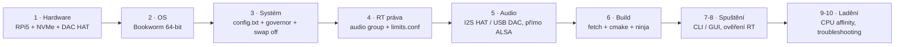
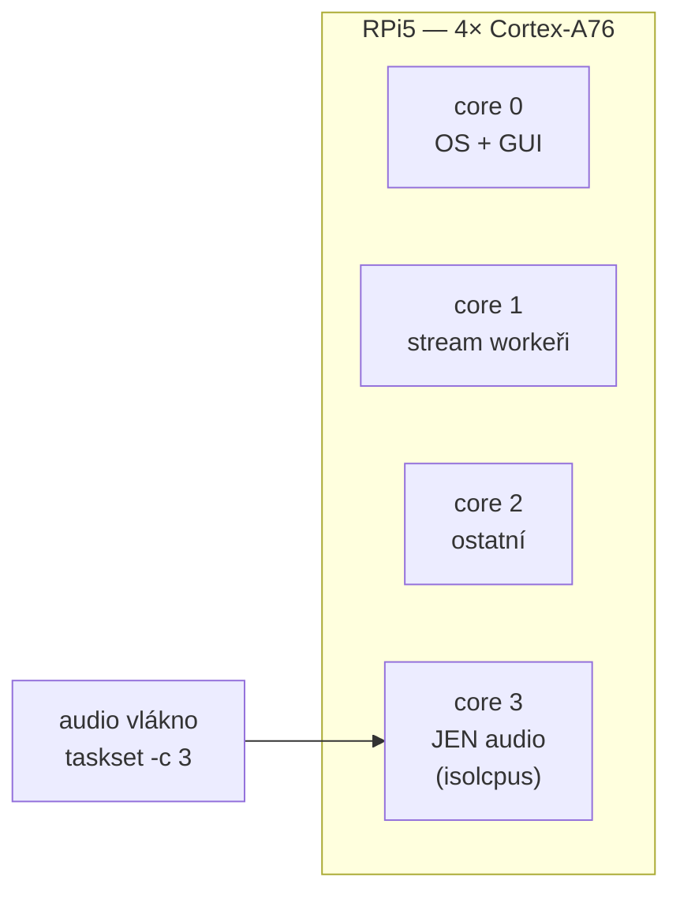

# 3 · Raspberry Pi 5

Raspberry Pi 5 není pro ithacu náhodná platforma — je to **explicitní cíl**.
Celé jádro je psané tak, aby zvládlo nízkou latenci i na čtyřjádrovém ARMu, a
streamování vzorků z disku má smysl právě tam, kde je RAM vzácná a banka velká.
Tahle kapitola provede kompletním nastavením: od čistého OS přes systémové
vyladění a oprávnění pro real-time běh až po první zahrání a doladění jitteru.

Postup vychází z reality kódu: ARM ladění (`-mcpu=native`) je zapnuté v
`../../CMakeLists.txt` (Release na aarch64), automatický RAM rozpočet banky se
počítá v enginu jako ~60 % fyzické paměti a real-time priorita má na RPi
specifické nároky popsané v [reference G — DSP](../reference/G-dsp.md) a v
[reference I — multithreading](../reference/I-multithreading.md).

Velký obrázek vypadá takhle:



## 1 · Hardware

Hardware vybírej se dvěma cíli: **rychlá random read** (kvůli streamování
vzorků) a **stabilní takt CPU** (kvůli rovnoměrnému renderu audio bloku).
Všechno ostatní jde sekundárně.

| Komponenta | Doporučení | Proč |
|---|---|---|
| **Deska** | RPi 5 (**8 GB**) | 4× Cortex-A76 @ 2,4 GHz + NEON (4-wide SIMD). 8 GB dá automatickému RAM rozpočtu (~60 % = ~4,8 GB) pohodlí. 4 GB je stále funkční, ale s menšími bankami. |
| **Úložiště — řadič** | **Pimoroni NVMe Base Duo** (2× M.2 2230/2242/2280) | Stackuje pod RPi5 přes PCIe 2.0 x1. Dva sloty = buď jen jeden NVMe teď a expanze později, nebo „hot data" na jednom disku a sample banky na druhém. Pin-thru shoda s GPIO headerem umožní nad NVMe Base stackovat ještě DAC HAT bez konfliktu. |
| **Úložiště — levnější** | Pimoroni NVMe Base (single), Geekworm X1001, Pineboards HatDrive! | Jednoslotové varianty, stejné PCIe 2.0 x1, stejná rychlost. |
| **NVMe SSD** | 256–1000 GB M.2 2280 (Samsung 980, WD SN570, Crucial P3) | Streaming chce nízkou latenci náhodného čtení. NVMe ~3000 MB/s vs. micro-SD A2 ~100 MB/s. Form factory 2230/2242 se na Base Duo vejdou taky. |
| **Úložiště — fallback** | USB 3.0 SSD + USB-SATA adaptér | Lacinější záchrana, ~400 MB/s — taky stačí. |
| **Boot médium** | micro-SD (A2) pro bootloader, NVMe pro rootfs | Od Bookworm umí `rpi-eeprom` boot přímo z NVMe. Bezpečný postup: napřed boot z SD, instalace, až pak migrace na NVMe. |
| **Audio výstup** | **I2S DAC HAT** (HiFiBerry DAC+/DAC2 Pro, IQaudio DAC Pro, Pimoroni Audio DAC SHIM) | Nízká latence, bit-exact 24/48 nebo 24/96, žádný USB jitter. |
| **Audio — alternativa** | USB Class-Compliant DAC (Topping E30 II, Schiit Modi 3+, Behringer UCA222) | Plug-and-play přes ALSA. |
| **NE** | Onboard 3,5mm PWM audio na RPi5 | Horší kvalita než na RPi4 (jen PWM); pro hraní nepoužitelné. |
| **Napájení** | **Oficiální 27W USB-C PSU** | RPi5 + NVMe + audio HAT žere pod zátěží ~12 W; podnapájení → CPU throttle → výpadky audia. Třetí-stranné zdroje bývají pod spec. |
| **Chlazení** | **Oficiální Active Cooler** nebo case s ventilátorem (Argon NEO 5, FLIRC) | A76 na 100 % zátěž bez chlazení = >80 °C → thermal throttle na 1,5 GHz → audio se rozpadne. |
| **MIDI vstup** | USB MIDI klávesy (přímo) **nebo** USB → DIN5 adaptér (M-Audio Uno, Roland UM-ONE) | RtMidi to chytá přes ALSA Sequencer (`__LINUX_ALSA__` v `third-party/CMakeLists.txt`). |

## 2 · Instalace OS

**Doporučený systém:** Raspberry Pi OS **64-bit Bookworm** (základ Debian 12).
Proč 64-bit? NEON SIMD a `-mcpu=native` dávají smysl jen na aarch64 — na
32bitovém OS přijdeš o část výkonu, na který je convolver laděný.

Vyber si variantu podle nasazení:

- **Lite** — když RPi poběží jako audio modul bez monitoru (deploy režim).
- **Standard (s desktopem)** — když chceš na RPi přímo buildit a vyvíjet GUI.

### Postup

1. Stáhni **Raspberry Pi Imager** (Win/macOS/Linux): https://www.raspberrypi.com/software/
2. Vlož SD kartu (≥ 16 GB) nebo NVMe přes USB-NVMe enclosure.
3. V Imageru: **Raspberry Pi 5** → **Raspberry Pi OS (64-bit)** → cílové médium.
4. **Před zápisem** klikni na ozubené kolečko (advanced):
   - Hostname: `ithaca-pi` (nebo cokoliv)
   - Enable SSH: ano (klíč nebo heslo)
   - User: vytvoř vlastní (**ne** `pi` — Bookworm už default uživatele nemá)
   - Wi-Fi nebo Ethernet
   - Locale: `cs_CZ.UTF-8` nebo `en_US.UTF-8`, timezone `Europe/Prague`
5. Write → počkej → eject → boot RPi.
6. Připoj se přes SSH: `ssh user@ithaca-pi.local`
7. Aktualizuj: `sudo apt update && sudo apt full-upgrade -y && sudo reboot`

### Boot z NVMe (volitelné, doporučené)

Při rychlém úložišti je rozdíl proti SD při načítání banky obrovský. Při prvním
spuštění (z SD) aktualizuj EEPROM a přehoď pořadí bootu:

```bash
sudo rpi-eeprom-update -a
sudo reboot
sudo raspi-config nonint do_boot_order B2   # NVMe first
```

Pak naklonuj SD → NVMe (`rpi-clone` nebo `dd`) a boot už pojede z NVMe.

## 3 · Systémové nastavení

Tady jde o tři věci: nakonfigurovat hardware (DAC, NVMe), **držet CPU na plném
taktu** a **zbavit se page-outu**. Všechny tři přímo ovlivňují, jestli audio
vlákno stihne svůj blok včas.

### `/boot/firmware/config.txt`

Přidej na konec:

```
# --- ithaca-legacy: audio + výkon ---

# I2S DAC HAT (příklad pro HiFiBerry; pro jiné HATy viz jejich dokumentaci):
dtoverlay=hifiberry-dacplus

# Vypnout onboard PWM audio (koliduje s I2S routou + zbytečná spotřeba):
dtparam=audio=off

# Maximální boost (RPi5 A76 staticky na 2,4 GHz; bez boostu nižší):
arm_boost=1

# NVMe na PCIe HAT (pokud relevantní):
dtparam=nvme
dtparam=pciex1_gen=3
```

Po editaci reboot.

### CPU governor: `performance` (kritické)

Výchozí governor `ondemand` při malé zátěži CPU podtaktuje (obdoba P-states na
Windows). To je pro nás problém: audio vlákno dostane nižší takt, a tím se
**kolísá wall-time renderu** — blok, který se jindy spočítá za 2 ms, najednou
nestihne deadline. Řešení je trvale držet governor na `performance`.

**Rychlý test:**

```bash
sudo cpufreq-set -g performance
cat /sys/devices/system/cpu/cpu0/cpufreq/scaling_governor   # → "performance"
```

**Trvale** přes systemd službu:

```bash
sudo tee /etc/systemd/system/cpu-performance.service <<'EOF'
[Unit]
Description=Set CPU governor to performance
After=multi-user.target

[Service]
Type=oneshot
ExecStart=/bin/sh -c 'echo performance | tee /sys/devices/system/cpu/cpu*/cpufreq/scaling_governor'
RemainAfterExit=yes

[Install]
WantedBy=multi-user.target
EOF

sudo systemctl daemon-reload
sudo systemctl enable --now cpu-performance.service
```

### Vypnout swap

Audio běží s RT prioritou a uzamčenou pamětí (`mlock`) — page-out je přesně to,
co nechceme. Stránka odložená na disk znamená v nejhorší chvíli čekání na I/O
v real-time vlákně. Swap proto vypni:

```bash
sudo systemctl disable dphys-swapfile
sudo swapoff -a
```

Ověř `free -h` — řádek Swap musí být nulový.

### Vypnout wireless (volitelné, pro nejnižší jitter)

Pokud Wi-Fi/Bluetooth nepotřebuješ a jedeš přes ethernet, vypni je — přerušení
z wireless driverů přidávají ~50–200 μs jitteru:

```bash
echo 'dtoverlay=disable-wifi' | sudo tee -a /boot/firmware/config.txt
echo 'dtoverlay=disable-bt'   | sudo tee -a /boot/firmware/config.txt
```

## 4 · Uživatel a RT oprávnění

Aby si audio vlákno mohlo vyžádat real-time scheduling (`SCHED_FIFO`), musí mít
proces příslušná oprávnění. Bez nich `pthread_setschedparam()` vrátí EPERM,
engine spadne na default scheduling a začne kolísat. Postup je: zařadit
uživatele do skupiny `audio` a té skupině povolit RT limity.

### Skupina `audio`

Bookworm skupinu `audio` standardně má. Přidej do ní sebe:

```bash
sudo gpasswd -a $USER audio
groups   # měl by obsahovat "audio"
```

Pak se **odhlas a znovu přihlas** — členství ve skupině se promítne až do nového
shellu.

### `/etc/security/limits.conf`

Přidej na konec:

```
# --- RT scheduling pro audio (ithaca-legacy) ---
@audio - rtprio 99
@audio - memlock unlimited
@audio - nice -20
```

Po reloginu ověř:

```bash
ulimit -r       # → 99 (rtprio)
ulimit -l       # → unlimited (memlock)
ulimit -e       # → 40 nebo podobně (rozsah nice)
```

Bez téhle konfigurace ti `pthread_setschedparam(SCHED_FIFO)` vrátí EPERM a v
logu uvidíš „RT priorita selhala" i s tipem na tyhle řádky. Detaily k RT
prioritě audio vlákna jsou v [reference I — multithreading](../reference/I-multithreading.md).

### Alternativa: běh jako root

Pro standalone deploy (RPi jako audio modul bez interakce s uživatelem) je
nejjednodušší spustit engine přes systemd jako root — RT práva má pak
automaticky, bez ladění `limits.conf`. Příklad service unitu je [níže](#deploy-jako-systemd-služba).

## 5 · Audio HAT / DAC

Cíl je dostat zvuk **přímo na ALSA hardware device**, bez mezivrstvy. PipeWire
a PulseAudio přidávají latenci i kopírování bufferů — pro nás zbytečné.

### I2S HAT (příklad: HiFiBerry DAC+ / DAC2 Pro)

Po `dtoverlay=hifiberry-dacplus` v `config.txt` a rebootu:

```bash
aplay -l
# Měl bys vidět:
# card 0: sndrpihifiberry [snd_rpi_hifiberry_dacplus], device 0: HiFiBerry DAC+ HiFi pcm5102a-hifi-0 [...]
```

Test tónem:

```bash
speaker-test -D hw:0,0 -c 2 -t sine -f 440 -l 1
```

Slyšíš sinus → HAT funguje. Kontrola podporovaných sample rate / formátů:

```bash
aplay -D hw:0,0 --dump-hw-params /dev/zero
# hledej "RATE: ... 48000 ..." a "FORMAT: ... S16_LE S24_3LE S32_LE ..."
```

### USB DAC

Stejné jako I2S, jen v `aplay -l` bude `card 1: <jméno DAC>`. Tomu pak přizpůsob
volbu zařízení.

### Deterministický ALSA target

Vypiš stabilní jména zařízení (nemění se mezi rebooty), které pak zadáš do
GUI / CLI:

```bash
aplay -L | grep -A2 '^hw:'
```

Typicky chceš něco jako `hw:CARD=sndrpihifiberry,DEV=0`.

### Nepoužívej PipeWire / PulseAudio

Bookworm v desktop instalaci má PipeWire. Přidává 5–20 ms latence a kopii
bufferu — pro nás jdi rovnou na ALSA `hw:` device. Pokud PipeWire nechceš vůbec
(Lite varianta ho nemá):

```bash
sudo apt remove --purge pipewire pulseaudio
```

## 6 · Build: závislosti, clone, kompilace

Plný popis Makefile cílů je v [2 · Build a Makefile](02-build-makefile.md);
tady je jen to, co je specifické pro RPi5.

### Apt balíčky

```bash
sudo apt install -y \
    build-essential cmake git curl tar \
    libasound2-dev \
    python3 \
    pkg-config

# Pro panel (SDL3 + KMSDRM, tedy bez X):
sudo apt install -y \
    libdrm-dev libgbm-dev libegl1-mesa-dev libgles2-mesa-dev \
    libudev-dev
```

`libasound2-dev` je nutný pro miniaudio i RtMidi (ALSA backend).

Ke druhé skupině: SDL zapne backend KMSDRM jen když najde `libdrm`, `gbm` **a**
EGL — a hledá je výhradně přes `pkg-config`, takže ten musí být taky. Podrobný
rozpis, co která knihovna dělá, je v
[6 · Panel na Raspberry Pi](06-panel-a-rpi.md#balíčky-a-k-čemu-jsou).

> `xorg-dev` je potřeba **jen** když chcete i ladicí cestu `--video-driver x11`
> na Pi s desktopem. Pro samotný přístroj se neinstaluje.

### Clone

```bash
cd ~
git clone https://github.com/alchy/ithaca-legacy.git
cd ithaca-legacy
```

### Build

```bash
make check-tools           # ověří cmake/ninja v PATH
make fetch-third-party     # stáhne doctest, nlohmann, miniaudio, RtMidi, ImGui, SDL3
make build                 # cmake configure + build
```

První build trvá na RPi5 ~3–5 minut (clean + plná kompilace), inkrementálně pak
< 30 s.

Při Release buildu na aarch64 přidá `../../CMakeLists.txt` (řádky 47–48) přepínač
`-mcpu=native`, a to jen pokud `CMAKE_SYSTEM_PROCESSOR` odpovídá
`aarch64|armv8|armv7` a konfigurace je `Release`. Díky tomu NEON FMLA
autovektorizuje vnitřní smyčku convolveru přesně na ten Cortex-A76, na kterém
buildíš. (Při cross-compile flag uprav nebo vynech — předpokládá se nativní
build na cílovém zařízení.)

### Test suite

```bash
make test     # ctest
```

`M_PI` na Linux GCC není problém (na rozdíl od MSVC), takže `test_ir_modal` i
`test_convolver` projdou bez `_USE_MATH_DEFINES`.

> **Jeden test na Pi selže a je to očekávané.** `test_render_regression` je
> bit-exact strážce audio výstupu a jeho konstanty jsou **vázané na toolchain** —
> po změně platformy se musí přegenerovat. Podrobnosti a postup jsou v
> [2 · Build a Makefile](02-build-makefile.md#testy-vázané-na-prostředí).

### CLI smoke test

```bash
./build/ithaca-cli --selftest
```

Výstup má končit `self-test OK`. Binárky vznikají přímo v `build/`, tedy
`./build/ithaca-cli` a `./build/ithaca-gui`.

## 7 · Konfigurace enginu na RPi5

Tady je důležitá oprava proti starší dokumentaci. **Engine nečte žádný
`config.json`.** Soubor `config.json` v rootu repa sice obsahuje klíče jako
`preload_ms`, `cache_budget_mb`, `max_voices`, `stream_threads` nebo
`render_threads`, ale **žádný kód ho neotvírá** — je to dnes nepoužívaný
„orphan" soubor (viz [plán a nedodělky, sekce G1](../plan2do.md)).

Jak se tedy engine konfiguruje doopravdy:

- **CLI (`ithaca-cli`)** staví `EngineConfig` inline (v `app/cli/main.cpp`) a
  bere jen **CLI flagy**. Z nich nastavuje `block_size`, parametry rezonance
  (`resonance_gain_db`, `resonance_layer_db`) a `rt_priority`. Vše ostatní
  (`preload_ms`, `resonance_window_ms`, `max_voices`, `stream_threads`,
  `cache_budget_mb`) zůstává na **výchozích hodnotách** `EngineConfig` — přes CLI
  je dnes nezměníš.
- **GUI (`ithaca-gui`)** si nastavení perzistuje do `state.json` (ne do
  `config.json`). Schéma `state.json` a kde leží popisuje
  [4 · Konfigurace](04-konfigurace.md).

### RAM rozpočet banky je automatický

Klíč, který lidi často chtějí ladit, `cache_budget_mb`, se ve výchozím stavu
počítá **sám**. Když je `cache_budget_mb` nula (default), engine vezme **~60 %
fyzické RAM** jako strop (`engine.cpp`: `ram * 6 / 10`). Na 8 GB RPi to vyjde
~4,8 GB, na 4 GB ~2,4 GB. Je to ochrana proti OOM na embedded zařízeních — když
součet preload heads + RAM cache rezonance překročí rozpočet, loader načítání
přeruší a zaloguje chybu, místo aby spadl na `bad_alloc`.

Pro většinu nasazení tedy **nemusíš dělat nic** — auto-rozpočet i auto-sizing
stream workerů (podle počtu jader) se postará sám. Kdyby ses do toho někdy chtěl
opravdu šťourat, dnes by to znamenalo zasáhnout do defaultů v `EngineConfig`,
ne editovat `config.json`.

### Kam GUI ukládá `state.json`

Na Linuxu se `state.json` ukládá do `$XDG_CONFIG_HOME/ithaca-legacy/state.json`
(typicky `~/.config/ithaca-legacy/state.json`) a vzniká při prvním ukončení GUI.
Podrobnosti i schéma najdeš v [4 · Konfigurace](04-konfigurace.md).

## 8 · První spuštění a ověření

### CLI režim (deploy bez GUI)

```bash
./build/ithaca-cli --play /cesta/k/bance --midi-in "USB MIDI" --block-size 256
```

V logu sleduj:

```
[..] [engine] [INFO]: stream workers: main=2 resonance=1 (jader=4)
[..] [loader] [INFO]: RAM budget banky: auto 4800 MB (60% z 8192 MB fyzické)
[..] [audio]  [INFO]: Audio start: <DAC name> SR=48000 block=256
[..] [audio]  [INFO]: RT priorita aktivní (sr=48000 block=256)   ← KRITICKÉ
```

**Poslední řádek** je potvrzení, že se `SCHED_FIFO` aktivoval. Pokud místo toho
uvidíš:

```
[audio] [WARNING]: RT priorita selhala (err=1) — default scheduling, jitter risk
[audio] [INFO]: TIP: přidej do /etc/security/limits.conf řádky ...
```

→ chybí krok 4 (skupina `audio` + `limits.conf` + relogin).

### GUI režim

```bash
./build/ithaca-gui --bank-dir /cesta/k/bankám --log-level info
```

Na zabudovaném panelu přidej `--fullscreen` — okno pak nemá dekorace a zabere
celou plochu:

```bash
./build/ithaca-gui --fullscreen --bank-dir /cesta/k/bankám
```

> Panel jede přes SDL3/KMSDRM, tedy **přímo na framebuffer bez X11 a Waylandu**.
> Pi ale musí bootovat do konzole — desktop obsadí KMS a backend selže.
> Kompletní postup (oprávnění, boot, ladicí páky) je v
> [6 · Panel na Raspberry Pi](06-panel-a-rpi.md).

Panel se otevře na stránce **PLAY**: uprostřed vybraná banka, pod ní řádek
`VOICES · RESO · RING · RING RESO · PEAK dB · DSP · SUSTAIN` a dvojice MIDI
kontrolek. Hraj.

**DSP** (procento zátěže DSP řetězce) by měl při pravidelné zátěži
(akord + sustain) zůstat stabilně **pod 60 %**. Pokud kolísá nad 100 % →
underrun a audio vypadává; rozsvítí se kontrolka `UNDERRUN` v patičce.

Sloupce `RING` a `RING RESO` jsou obsazenost streamovacích ringů — podle nich
se ladí `MAX RESONANCE`. Úroveň logu jde přepnout za běhu na stránce **LOG**.

MIDI kanály se na **SYS** zapínají jednotlivě (šestnáct polí ve dvou řádcích);
všechny zapnuté = OMNI. Když zhasneš všechny, nepřijde žádné MIDI — panel to
hlásí jako `NONE - MIDI MUTED`.

Podrobný popis panelu je v [H-gui](../reference/H-gui.md).

### Test latence

Ideálně se měří mikrofonem a osciloskopem: čas MIDI vstupu vs. okamžik
akustického výstupu. Bez vybavení aspoň subjektivně — odezva na úhoz má být
„okamžitá" (< 10 ms). Pro měřitelný test nahraj hraní s mikrofonem a click
trackem a porovnej MIDI timestamp s audio událostí v DAW (Reaper, Ardour).

### Deploy jako systemd služba

Pro automatický start po bootu:

```bash
sudo tee /etc/systemd/system/ithaca.service <<EOF
[Unit]
Description=ithaca-legacy audio engine
After=sound.target

[Service]
Type=simple
User=$USER
WorkingDirectory=/home/$USER/ithaca-legacy
ExecStart=/home/$USER/ithaca-legacy/build/ithaca-cli --play /cesta/k/bance --midi-in "USB MIDI" --block-size 256
LimitRTPRIO=99
LimitMEMLOCK=infinity
Nice=-10
Restart=on-failure

[Install]
WantedBy=multi-user.target
EOF

sudo systemctl daemon-reload
sudo systemctl enable --now ithaca.service
journalctl -u ithaca -f      # sleduj log
```

`LimitRTPRIO` a `LimitMEMLOCK` v unitu přepíšou per-process limity bez ohledu na
`/etc/security/limits.conf` — bezpečná cesta, když nechceš ladit system-wide
limity.

## 9 · CPU affinity (pokročilé, volitelné)

Pro nejnižší jitter můžeš izolovat jedno jádro výhradně pro audio. Myšlenka:
když audio vlákno běží samo na jádře, nikdo ho nepřeruší a render bloku je
maximálně předvídatelný.

V `/boot/firmware/cmdline.txt` přidej na **konec stávajícího řádku** (cmdline.txt
musí zůstat jeden řádek — žádné nové řádky):

```
isolcpus=3 nohz_full=3 rcu_nocbs=3
```

Reboot a ověř `cat /proc/cmdline`. Pak v `ithaca.service` přidej k audio procesu
pinning:

```ini
[Service]
ExecStart=/usr/bin/taskset -c 3 /home/.../ithaca-cli --play ...
```

Audio vlákno tím dostane jádro 3 exkluzivně; jádra 0–2 nesou GUI, OS, stream
workery a vše ostatní.



**Pozor:** `isolcpus` znamená, že jádro 3 nedostane balancovaný scheduling —
poběží na něm *jen* tasky na něj připnuté. Když zapomeneš audio vlákno připnout,
jádro 3 leží ladem.

**Měkčí varianta** bez `isolcpus`: jen pinning na jádro 3 přes `taskset`. Ostatní
tasky tam smí být taky, ale audio vlákno tam má přednost.

## 10 · Troubleshooting

### „RT priorita selhala (err=1)"

`err=1` = EPERM = nedostatečná práva.

- Ověř `groups | grep audio` — jsi ve skupině?
- Ověř `ulimit -r` — vrací 99?
- Pokud něco z toho ne → krok 4 (`limits.conf` + `gpasswd` + relogin).
- U systemd služby zkontroluj `LimitRTPRIO=99` v unitu.

### Audio nehraje (žádný zvuk)

- `aplay -l` — vidíš kartu HAT/DAC?
- `speaker-test -D hw:0,0 -c 2 -t sine -f 440 -l 1` — slyšíš sinus?
- V `state.json` (GUI) ověř, že audio device vede na správnou kartu (ne na
  PipeWire `pulse` device).
- Hlasitost: `alsamixer` — není mute / na nule?

### Audio vypadává při hraní

- Sleduj sloupec `DSP` na stránce PLAY (GUI) nebo `dspLoadPeak()` (CLI log).
- > 100 %: zvyš `--block-size` z 256 na 512 (lepší tolerance, vyšší latence).
- Kontrolka `UNDERRUN` v patičce (a sloupce `RING` / `RING RESO` na PLAY) =
  stream underrun → banka je na pomalém úložišti (SD karta?), migruj na NVMe.
- Pokles napětí pod zátěží: `vcgencmd get_throttled` — nenulová hodnota =
  napájecí problém, použij oficiální 27W PSU.

### Vysoká teplota / thermal throttle

```bash
vcgencmd measure_temp   # mělo by být < 75 °C pod zátěží
vcgencmd get_throttled  # nenulový bit = throttle aktivní
```

→ Active Cooler, lepší pasivní chlazení, větší case s ventilátorem.

### Build selže

- Chybí `libasound2-dev`? Při kompilaci RtMidi → „ALSA/asoundlib.h not found".
- Panel se neotevře (`no available video device`)? Viz
  [6 · Panel na Raspberry Pi](06-panel-a-rpi.md#když-to-nejede).
- Práva na vendor adresáři? `fetch-third-party.sh` má dostat chmod 755.

### Kernel / driver problémy

Při silném jitteru zvaž:

- PREEMPT_RT kernel (oficiální Ubuntu Studio image pro RPi5, nebo self-build).
- Vyšší `--block-size` 512/1024 pro toleranci k jitteru.
- Vypnout USB power management: `echo on > /sys/bus/usb/devices/.../power/control`.

## Odkazy

Externí:

- Oficiální setup RPi: https://www.raspberrypi.com/documentation/computers/getting-started.html
- Konfigurace HiFiBerry: https://www.hifiberry.com/docs/
- Linux audio realtime guide: https://wiki.linuxaudio.org/wiki/system_configuration

V knížce:

- [2 · Build a Makefile](02-build-makefile.md) — kompletní popis Makefile cílů
- [4 · Konfigurace](04-konfigurace.md) — `state.json` (GUI), kam se ukládá a co obsahuje
- [reference G — DSP](../reference/G-dsp.md) a [reference I — multithreading](../reference/I-multithreading.md) — vlákna, RT priorita, synchronizace v enginu
- [Plán a nedodělky](../plan2do.md) — mj. sekce G1 (orphan `config.json`)
