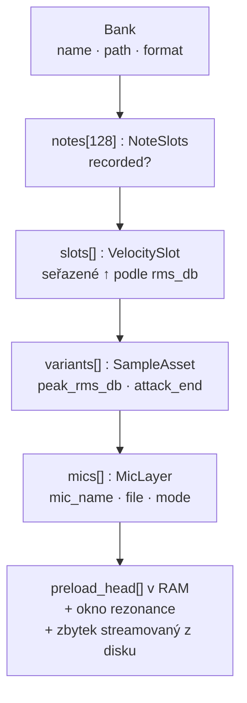
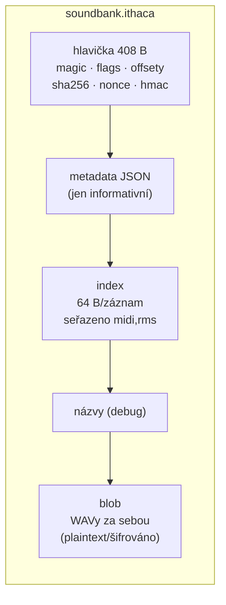
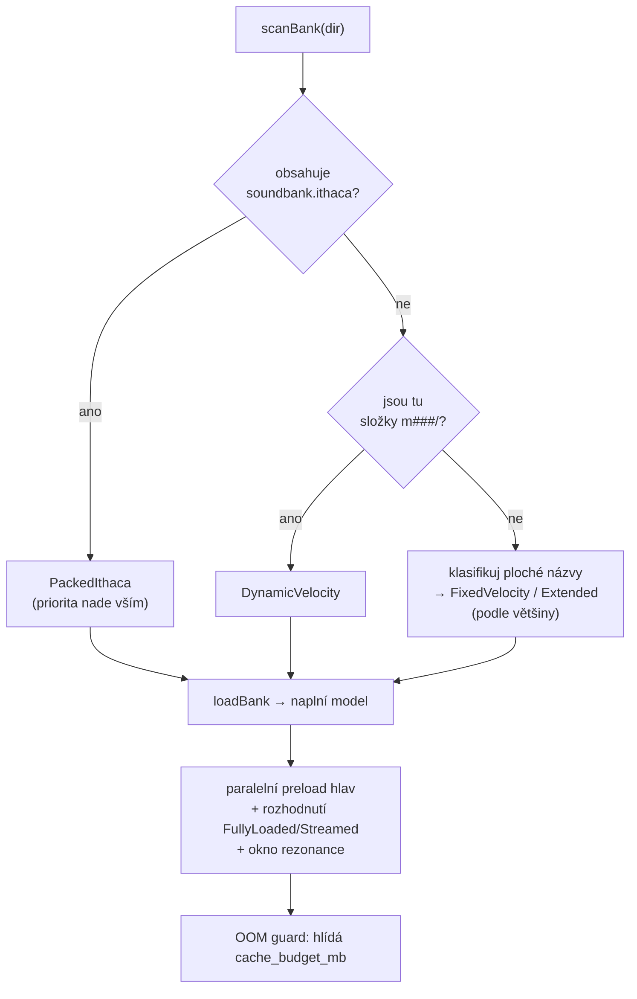
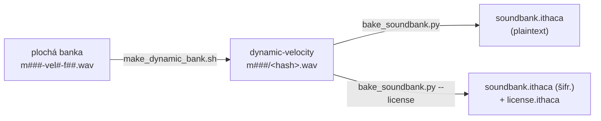

# 5 · Formát banky

Banka je to, co ithaca hraje — sada nahrávek jednoho nástroje. Na disku může mít
**tři podoby**: plochý adresář (*fixed-velocity*), adresář se složkou na notu
(*dynamic-velocity*), nebo jediný soubor (*packed* `soundbank.ithaca`, volitelně
šifrovaný a licencovaný). Tahle kapitola je projde všechny — ale začne tím, co
mají společné, protože to je klíč k pochopení celého formátu:

> **V paměti je vždy jeden a tentýž model.** Ať banku načteš z plochého
> adresáře, ze složek, nebo z pakovaného souboru, výsledkem je identická
> struktura `Bank`. Liší se jen *jak* se na disku najdou soubory; co se z nich
> postaví, je stejné. Proto se přehrávací část (hlasy, engine) nikdy nestará o
> to, odkud banka přišla.

## Model v paměti

Banka je strom. Nahoře 128 MIDI not; každá nahraná nota nese seznam **velocity
vrstev** seřazených od nejtišší po nejhlasitější; každá vrstva může mít víc
**variant** (pro round-robin) a každá varianta jednu či víc **mikrofonních
pozic**. List stromu — `MicLayer` — drží vlastní audio data (začátek v RAM,
zbytek na disku).



Definice žijí v `engine/sample/sample_types.h`; podrobnosti o tom, jak se strom
plní a streamuje, jsou v [reference: Loader](../reference/F-loader.md). Dnes jsou
dvě osy stromu **degenerované**: `variants[]` má vždy jednu položku (round-robin
clustering [zatím není](../plan2do.md#a2-round-robin-clustering)) a `mics[]` taky
jednu, pojmenovanou `"stereo"` (multi-mic je [plánovaný](../plan2do.md#a1-multi-mic-mixing-fáze-6)).

## Společný princip: velocity podle naměřeného RMS

Tohle je nejdůležitější myšlenka celého formátu, a platí pro **všechny tři
podoby**:

> Velocity vrstvy se neberou z názvu souboru. Loader u každého vzorku **změří
> peak RMS** (klouzavé ~50 ms okno, max → dBFS) a vrstvy **seřadí podle té
> naměřené hodnoty**, od nejtišší po nejhlasitější. Případný `velN` v názvu je
> jen poradní — rozhodující je změřená hlasitost.

Z toho plyne pružnost: nota může mít libovolný počet vrstev a pořád to sedí.
Při hraní engine namapuje příchozí MIDI velocity `0–127` na ten proměnný počet
vrstev proporcionálně (`slotIndexForVelocity`, `patch_manager.cpp:18-25`):

```cpp
int slotIndexForVelocity(int velocity, int nslots) {
    if (nslots <= 1) return 0;
    float t   = (float)velocity / 127.f;          // 0..1
    int   idx = (int)((t * (nslots - 1)) + 0.5f); // zaokrouhli na nejbližší vrstvu
    return clamp(idx, 0, nslots - 1);
}
```

Osa `0–127` se tak rozdělí na `nslots` zhruba stejně širokých pásem. Protože
`nslots` je **per nota** (= počet souborů u té noty), **rozlišení dynamiky se
mění napříč klaviaturou**: nota nahraná v 12 vrstvách má jemnější dynamiku než
nota ve 4 vrstvách — bez jediného řádku metadat.

| Nota | Vrstev | Šířka pásma | Efekt |
|------|--------|-------------|-------|
| `m036` | 4  | ~42 velocity | hrubá dynamika |
| `m060` | 8  | ~18 velocity | střední |
| `m072` | 12 | ~11 velocity | **hustá** dynamika |

Pozor na rozdíl: tohle mapování vybírá *který vzorek* zazní. Jeho *hlasitost*
řeší zvlášť `vel_gain = (v/127)²` (`patch_manager.cpp:67-68`), tedy
percepčně kvadraticky.

---

Teď ke třem podobám na disku. Liší se jen způsobem, jak loader najde soubory.

## Podoba 1: fixed-velocity (plochý adresář)

Nejjednodušší banka: **adresář WAV souborů**, žádný manifest, žádný index.
Strukturu nese **název souboru** — `m<MIDI>-vel<N>-f<SR>.wav`:

```
vi-ravenscroft/                ← název adresáře = název banky
├── m021-vel0-f48.wav          ← MIDI 21 (A0), vrstva 0, nahráno @48 kHz
├── m021-vel1-f48.wav
├── ...
└── m108-vel7-f48.wav          ← MIDI 108 (C8), vrstva 7
```

Gramatiku parsuje jediný case-insensitive regulární výraz (`bank_index.cpp:15`):
`m` + 3 číslice MIDI, `-vel` + 1 číslice, `-f` + 2–3 číslice SR, `.wav`. Adresář
se skenuje **nerekurzivně**; co se netrefí do gramatiky, se přeskočí (žádná tvrdá
chyba — překlep v názvu vzorek tiše zahodí).

Oba číselné tokeny kromě MIDI jsou **jen poradní**:

- **`velN`** určuje jen *který soubor existuje* — pořadí vrstev dělá naměřené RMS
  (viz výše).
- **`fSS`** (SR tag) se parsuje, ale **ignoruje** — skutečné SR čte engine z WAV
  hlavičky. Nesoulad tokenu a hlavičky nemá žádný efekt.

Tahle podoba je čitelná a snadno se edituje, ale všechno je „zadrátované do
názvu" a nejde popsat nic navíc (licence, loop pointy, víc mikrofonů). Proto
vznikla podoba druhá.

## Podoba 2: dynamic-velocity (složka na notu)

Místo plochých názvů má každá nota **vlastní podsložku** a v ní libovolný počet
vzorků pojmenovaných jen **krátkým obsahovým hashem**:

```
<BankName>/
├── m021/
│   ├── 3f9a1c2b.wav        ← jedna velocity vrstva pro MIDI 21
│   ├── a7e0445d.wav        ← další vrstva
│   └── c81b9f30.wav
├── m060/
│   └── ...
└── m108/
    └── ...
```

Strukturu nese **jen název složky** (`m###` = MIDI nota); všechno ostatní se
odvodí při načtení, přesně jako u fixed-velocity:

| Vlastnost | Odkud |
|-----------|-------|
| MIDI nota | název složky `m###` |
| sample rate | WAV hlavička (per soubor) |
| kanály | WAV hlavička; mono se up-mixuje na stereo |
| počet vrstev | **= počet WAV souborů ve složce** (per nota) |
| pořadí vrstev | **naměřené peak RMS** (soft → loud) |

Název souboru je **neprůhledný** — loader ho nikdy nečte, takže odpadá křehký
problém „sémantika v názvu". Hash je obsahový (identické nahrávky se
deduplikují), stačí když je unikátní v rámci složky. Tahle podoba je dnešní
doporučený formát pro adresářové banky a **vstup pro pakování** (níže).

> Obě adresářové podoby se načítají **stejnou cestou**: `loadBank` rozhodne podle
> detekovaného formátu a oba ingestuje týmž per-sample postupem (žádná zvláštní
> funkce „loadFolderBank" — jeden sjednocený loader, `sample_store.cpp`).

## Podoba 3: packed (`soundbank.ithaca`)

Pro distribuci se celá dynamic-velocity banka zabalí do **jednoho souboru**.
Výhody: jeden artefakt ke stažení, jeden file descriptor při načítání (žádné
`fopen` na soubor), žádný sken adresáře, a **předpočítaná analýza** (RMS, attack)
přímo v indexu — načítání tak přeskočí měření, které adresářový loader dělá.
Audio uvnitř je **doslovný WAV**, balení je bajt-přesné a vratné.

Banka je buď **plaintext** (kdokoli ji rozbalí), nebo **šifrovaná + licencovaná**
(v2, vázaná na kupce) — je to **stejný formát, liší se jediným bitem v hlavičce**.

### Rozvržení souboru

Little-endian, čtyři sekce za hlavičkou:

```
[ hlavička 408 B ][ metadata JSON ][ index 64 B/záznam ][ názvy ][ blob ]
```

Hlavička (408 B) nese magii `"ITHACABK"`, verzi, `flags` (bit0 = šifrováno,
bit1 = podepsáno — rezervováno, [neimplementováno](../plan2do.md#a6-asymetrický-podpis-packed)),
offsety/velikosti všech sekcí, `entry_count`, dva SHA-256 otisky a v2 pole pro
šifru (`cipher_id`, `nonce`, `hmac_tag`):

- **`sha256_index`** (přes metadata+index+názvy) se ověřuje **při každém načtení**
  (sekce jsou malé).
- **`sha256_payload`** (přes blob) se kontroluje **jen** při `bake --verify` — na
  multi-GB souboru by jinak zdržoval start.

**Index** má 64 B na záznam: `midi`, `channels`, `sample_rate`, offset+velikost
WAV uvnitř souboru, offset PCM dat, `sample_format` (PCM16/24/32/float32),
`frames`, `rms_db` (autoritativní pro pořadí vrstev) a `attack_end`. Záznamy jsou
**předřazené podle `(midi, rms_db vzestupně)`** — loader je commituje v pořadí
indexu a už nikdy nepřerovnává.



### Plaintext vs. šifrovaná (v2)

Šifrovaná banka má nastavený `flags` bit0, `cipher_id = 1`, náhodný `nonce`,
reálný `hmac_tag` a vedle sebe soubor **`license.ithaca`** (plaintext JSON s
identitou kupce). Bajtové rozvržení je jinak totožné — stejný loader čte obojí,
liší se jen bajty blobu (šifrovaný vs. holý) a vyplněná v2 pole.

Šifrování stojí na **vlastní `Sha256`, bez externí krypto závislosti**:

- **Blob** je XORován SHA-256 CTR keystreamem:
  `keystream_block(i) = HMAC-SHA256(bank_key, nonce ‖ u64le(i))`, blok
  `i = pozice/32`. Random-access — streamovací seek dešifruje jen přečtené bajty.
  Hlavička/index/názvy zůstávají plaintext, aby loader mohl seekovat.
- **Klíče** se odvozují z **master secretu** (zkompilovaného v binárce) a
  **přesných bajtů `license.ithaca`**:
  `bank_key = HMAC-SHA256(master_secret, "ithaca-enc-v2" ‖ license)`,
  `mac_key = HMAC-SHA256(master_secret, "ithaca-mac-v2" ‖ license)`.
- **Integrita:** `hmac_tag = HMAC-SHA256(mac_key, metadata ‖ index ‖ názvy ‖ license)`.

Tím je identita kupce **kryptograficky svázaná**: editace (nebo odebrání)
`license.ithaca` změní odvozený klíč / rozbije tag → engine banku odmítne načíst
a GUI ukáže *„Soundbank is corrupted or license file is invalid."*. Kupec licenci
**přečte** (transparentnost), ale **nezmění**, aniž by banku znefunkčnil.

> **Threat model: odrazení + dohledatelnost, ne neprůstřelné DRM.** Symetrický
> klíč je v binárce a dešifrované audio je v RAM — odhodlaný uživatel audio vždy
> dostane. Cena je jinde: (a) zvednout laťku nad triviální kopírování volných
> WAVů a (b) vtisknout do klíče identitu kupce, takže uniklá banka je
> dohledatelná. Plný design viz [reference: Loader](../reference/F-loader.md) a
> kód v `engine/util/ithaca_crypto.*`, `engine/io/file_handle.cpp`,
> `engine/sample/ithaca_bank.cpp`.

Master secret a jeho životní cyklus (commitnutý klíč, generace, rotace) jsou
popsané v kapitole [Build a Makefile](02-build-makefile.md) a v kořenovém
README; bakování (včetně `--license`) tamtéž.

## Jak se banka načítá

Načítání má dvě fáze: **detekci** formátu a **naplnění** modelu.



Autodetekce má jasnou prioritu: **packed → dynamic → flat**. Adresář se
`soundbank.ithaca` jde vždy pakovanou cestou; jinak rozhodují podsložky `m###/`;
teprve nakonec ploché názvy (a mezi `FixedVelocity`/`Extended` vítězí většina).

Naplnění modelu (detail v [reference: Loader](../reference/F-loader.md)):

- **Preload hlavy.** Z každého vzorku se do RAM načte jen **začátek**
  (`preload_ms`, default 150). Krátký vzorek (vejde se do `2 × preload_ms`) se
  drží **celý** (`FullyLoaded`); dlouhý jen hlavu a zbytek se **streamuje** z
  disku (`Streamed`).
- **Okno rezonance.** Pro streamované vzorky se navíc přednačte úsek pro
  sympatickou rezonanci (default **12 s**, `engine.h:39`) od přibližného konce
  attacku.
- **OOM guard.** Sčítá se rezidentní stopa (hlavy + okna rezonance) a hlídá se
  proti `cache_budget_mb`. **Default je `0` = auto ≈ 60 % fyzické RAM**
  (`engine.cpp`). Při překročení rozpočtu se načítání **přeruší** (ERROR,
  neúplná banka) — není to jen varování. *(U pakované banky se hlavy čtou
  paralelně přímo z blobu a u šifrované se přitom transparentně dešifrují.)*

## Sample rate a resampling

Engine běží na **pevném výstupním SR** (default **48 000 Hz**), nastavitelném jen
přes `audio_sample_rate` v `state.json` (v GUI read-only — viz
[Konfigurace](04-konfigurace.md)). **Sample rate je ale vlastnost jednotlivého
souboru, ne banky** — každý `MicLayer` si nese své SR z WAV hlavičky (resp. z
packed indexu). Smíšené SR v jedné bance jsou strukturálně podporované.

Když se SR vzorku liší od engine SR, engine převádí **za běhu** přehrávacím
krokem a **lineární interpolací**:

```cpp
// engine/voice/voice.cpp:109-110
pos_inc_ = pitch_ratio * (sample_sr / engine_sr);   // pitch_ratio je VŽDY 1.0
```

- `sample_sr == engine_sr` → `pos_inc = 1.0` (žádná konverze, nejlepší případ).
- 44,1 kHz na 48 kHz → `pos_inc ≈ 0,919` (upsampling).
- **96 kHz na 48 kHz → `pos_inc = 2,0`** (downsampling 2:1).

> **Pozor na kvalitu downsamplingu.** Korektní 2:1 downsampling = anti-alias
> low-pass → decimace. Runtime cesta dělá **jen decimaci**: při `pos_inc = 2,0`
> drží `frac` na nule a fakticky bere každý druhý frame → **aliasing** a lehce
> „zakalené" výšky. Lineární interpolace je navíc mizerný filtr i pro neceločíselné
> poměry. U klavíru je to subtilní (energie nad 24 kHz je nízká), ale měřitelné a
> zbytečné. Kvalitní runtime SRC je [plánovaný](../plan2do.md#b1-kvalitní-runtime-src).

**Proto doporučení: resampluj na 48 kHz offline kvalitním nástrojem (ffmpeg soxr
/ sox VHQ) PŘED bakováním.** Banka je pak nativně 48 kHz, engine hraje
`pos_inc = 1,0` → nula runtime konverze, nejlepší kvalita a ~poloviční RAM.

```sh
# ffmpeg + soxr (doporučeno)
ffmpeg -i in_96k.wav -af "aresample=48000:resampler=soxr:precision=28" \
       -c:a pcm_f32le out_48k.wav
```

Když přesto necháš banku v 96 kHz, hraje — ale s aliasingem, **~2× RAM** a
**2× streamingem** (vše se sizuje ve zdrojových framech), takže dřív narazíš na
OOM guard. A pozor: engine **nehlásí** SR mismatch ani smíšené SR — spolkne to
tiše (varování je [plánované](../plan2do.md#b2-varování-na-sr-mismatch--vynucení-jednotného-sr)).

> **Transpoziční resampling** (dopočítat chybějící notu pitch-shiftem) je
> **záměrně vypnutý** — chybějící (nota, velocity) = ticho. Kód je odložený mimo
> build v `engine/voice/_reserved_resampling.h`.

## Nástroje: převod a bakování



- **`tools/make_dynamic_bank.sh <plochá> <dynamic>`** — převede fixed-velocity na
  dynamic-velocity (přejmenuje na hashe; `velN` tag se zahodí, RMS řazení při
  načtení pořadí zrekonstruuje). Audio se nepřekóduje.
- **`tools/bake_soundbank.py`** (vyžaduje numpy) — zabalí dynamic-velocity adresář
  do `soundbank.ithaca`. `--verify` po zápisu ověří oba SHA-256 a bit-přesně
  porovná každý záznam se zdrojem. `--license` / `--license-json` vyrobí
  šifrovanou banku vázanou na kupce. Baker počítá `rms_db`/`attack_end` **stejným
  algoritmem jako engine** (replika v numpy), takže pořadí vrstev je identické
  jako u adresářového načtení.

Celý build/bake workflow (vč. master secretu) je v
[Build a Makefile](02-build-makefile.md) — cíl `make new-license`.

## Co se chystá

Formát má připravené osy, které ještě nejsou dotažené — všechny živé položky
jsou v [plánu](../plan2do.md):

- **Multi-mic** — víc mikrofonních pozic na notu (`main` + `room`/`close`),
  míchané fadery v GUI. Datový model (`mics[]`) hotový, chybí disk layout,
  párování v loaderu, mixer a GUI. → [plan2do A1](../plan2do.md#a1-multi-mic-mixing-fáze-6)
- **Round-robin clustering** — shlukovat takes s blízkým RMS do jedné vrstvy s
  variantami. Výběr variant hotový, shlukování ne. → [plan2do A2](../plan2do.md#a2-round-robin-clustering)
- **Nelineární velocity křivka**, **`bank.json` metadata side-file**,
  **komprese blobu**, **asymetrický podpis** packed banky — viz plán.
- **Extended** plochý formát (`m##-MIC-HASH.wav`) je dnes **odmítán** („faze 7").

---

| Chci… | Jdi na |
|-------|--------|
| pochopit, jak loader plní model | [reference: F · Loader](../reference/F-loader.md) |
| nastavit `audio_sample_rate` | [4 · Konfigurace](04-konfigurace.md) |
| zabalit a licencovat banku | [2 · Build a Makefile](02-build-makefile.md) |
| vědět, co se chystá | [Plán a nedodělky](../plan2do.md) |
