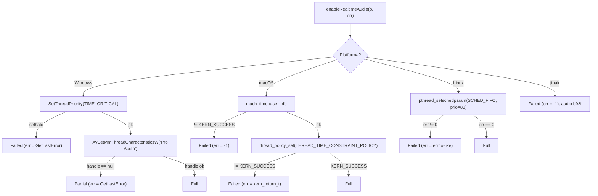

# J · RT priorita audio vlákna

Dokument popisuje **opt-in zvýšení priority audio vlákna u OS scheduleru** napříč
platformami. Není to tabulka souborů — je to výkladový rámec nad jedním modulem
(`engine/util/rt_priority.{h,cpp}`) a jeho voláním v `Engine::processBlock`.
Sousední téma (model vláken jako celek) je v [I-multithreading.md](I-multithreading.md);
provozní nastavení RT práv na cílovém hardwaru v
[../prirucka/03-raspberry-pi-5.md](../prirucka/03-raspberry-pi-5.md).

> Přehled: audio vlákno (`processBlock`) si při **prvním bloku per thread** —
> a jen pokud aplikace nastavila `EngineConfig::rt_priority` — vyžádá u OS
> scheduleru vyšší prioritu / RT politiku. Cílem je odstranit jitter (na Windows
> se projevoval oscilací hodnoty `DSP` 40–120 % i v klidu). Implementace je
> **idempotentní** (`thread_local` guard), **soft-failure** (při selhání jen
> WARN + TIP, audio běží dál na default scheduling — žádná regrese) a **per-thread**
> (stejný vzor jako `enableFlushDenormals`).

---

## K čemu to je a kdo to zapíná

RT priorita je **opt-in přes `EngineConfig::rt_priority`** (default `false`, viz
`engine/engine.h:67`). Zapínají ji výhradně reálné audio aplikace:

| Caller | Kde | Hodnota |
|--------|-----|---------|
| GUI | `app/gui/app_context.cpp:72` | `cfg.rt_priority = true` |
| CLI `--play` | `app/cli/main.cpp:170` | `cfg.rt_priority = true` |
| Testy, offline batch render | — | ponechávají default `false` |

Důvod, proč testy a offline render RT prioritu **nedostávají**: `SCHED_FIFO` na
hlavním vlákně by hrozil vyhladověním systému / killem přes `RLIMIT_RTTIME`.
RT smí mít jen krátkodobé, deadline-vázané audio vlákno řízené OS audio stackem.

## Společné rozhraní

Fasáda v `engine/util/rt_priority.h` (vzor přesně kopíruje `engine/util/denormals.h`):

```cpp
namespace ithaca {

enum class RtAudioStatus {
    Full    = 0,   // ok
    Partial = 1,   // částečný — primary API ok, sekundární (MMCSS) ne
    Failed  = 2,   // primary API selhalo, default scheduling
};

struct RtAudioParams {
    int sample_rate;   // např. 48000
    int block_size;    // např. 256
};

// Volat z audio vlákna při prvním processBlock (thread_local guard u callera).
// err_code je out param (errno / GetLastError / kern_return_t; smí být nullptr; 0 při Full).
RtAudioStatus enableRealtimeAudio(const RtAudioParams& p, int* err_code) noexcept;

// Volat z non-RT při shutdown (ruší MMCSS handle na Windows; jinde no-op).
void disableRealtimeAudio() noexcept;

} // namespace ithaca
```

| Symbol | Kotva | Poznámka |
|--------|-------|----------|
| `RtAudioStatus` | `rt_priority.h:22` | tři stavy: Full / Partial / Failed |
| `RtAudioParams` | `rt_priority.h:28` | `sample_rate`, `block_size` (jen macOS je čte) |
| `enableRealtimeAudio` | `rt_priority.h:35`, impl `rt_priority.cpp:28` | `noexcept`, vrací stav, plní `err_code` |
| `disableRealtimeAudio` | `rt_priority.h:38`, impl `rt_priority.cpp:97` | no-op všude kromě Windows |

`disableRealtimeAudio()` je no-op všude kromě Windows (jen tam drží stav —
MMCSS handle); není kritické ho volat při shutdown, handle se uvolní s procesem,
ale styl je explicitní cleanup.

## Rozhodovací strom (status per platforma)



Pozn.: stav **Partial vrací jen Windows** (TIME_CRITICAL prošel, MMCSS ne).
macOS i Linux jsou binární Full / Failed.

---

## macOS — Mach `THREAD_TIME_CONSTRAINT_POLICY`

Politika říká kernelu: *potřebuji X cyklů každých Y časových jednotek, hard
deadline Z*; scheduler pak garantuje slot a neodebere ho na běžné pre-emption
hranici. Parametry (`rt_priority.cpp:58`–`65`):

| Pole | Hodnota | Význam |
|------|---------|--------|
| `period_ns` | `block_size * 1e9 / sample_rate` | perioda bloku v ns |
| `period` | `period_ns` v Mach abs ticks | převod přes `mach_timebase_info` (denom/numer) |
| `computation` | `period / 2` | committed polovina bloku |
| `constraint` | `period` | hard deadline = perioda |
| `preemptible` | `0` | non-preemptible v rámci slotu |

Při selhání `mach_timebase_info` → `Failed` s `err = -1` (`rt_priority.cpp:55`).
Při selhání `thread_policy_set` → `Failed` s `err = kern_return_t`
(`rt_priority.cpp:74`). Cleanup je no-op — politika padne s vláknem.

Typické selhání: sandbox bez audio entitlementu (Mac App Store distribuce).
Pro vlastní lokální buildy běžně nehrozí.

---

## Windows — `SetThreadPriority` + MMCSS „Pro Audio"

Dva sloupce (`rt_priority.cpp:34`–`47`):

1. **`SetThreadPriority(THREAD_PRIORITY_TIME_CRITICAL)`** — nejvyšší user-space
   priorita. Selhání → `Failed` s `err = GetLastError()`.
2. **`AvSetMmThreadCharacteristicsW(L"Pro Audio")`** (MMCSS) — zaregistruje
   vlákno jako audio worker u Multimedia Class Scheduler Service; kernel mu pak
   garantuje typicky ~80 % kvanta i pod těžkým multitaskem. Když je `handle ==
   nullptr` (Server Core, WINE, vypnutá MMCSS service), vrátí se **Partial** s
   `err = GetLastError()` — audio běží jen s TIME_CRITICAL, víc jitteru.

Handle se drží v `thread_local g_mmcss_handle` (`rt_priority.cpp:25`); uvolní ho
`disableRealtimeAudio()` přes `AvRevertMmThreadCharacteristics` (`rt_priority.cpp:97`–`103`).

**CMake:** Windows větev linkuje `avrt` (MMCSS API) — `CMakeLists.txt:146`
(`winmm` tam není; samostatný `target_link_libraries(ithaca_core PUBLIC avrt)`).
Zdroj `engine/util/rt_priority.cpp` je mezi sources na `CMakeLists.txt:88`.

---

## Linux — POSIX `SCHED_FIFO` (realita: bez fallbacku)

Implementace (`rt_priority.cpp:80`–`87`) je **jednořádková politika a nic víc**:

```cpp
struct sched_param sp;
sp.sched_priority = 80;   // audio konvence: 70-90 (ne 99, RT watchdog headroom)
int err = pthread_setschedparam(pthread_self(), SCHED_FIFO, &sp);
if (err == 0) return RtAudioStatus::Full;
if (err_code) *err_code = err;
return RtAudioStatus::Failed;   // při selhání rovnou Failed
```

> **Pozor — oprava proti staré dokumentaci.** Bývalá `docs/rt-thread-priority.md`
> popisovala na Linuxu fallbacky, které kód **nemá**: ani `setpriority(PRIO_PROCESS,
> 0, -10)` jako poslední best-effort krok, ani **RTKit** (D-Bus
> `org.freedesktop.RealtimeKit1`). Stará verze je dokonce uváděla v testovacím
> plánu jako hotové. Realita: při `pthread_setschedparam != 0` se vrací rovnou
> `Failed` a caller zaloguje WARN + TIP. Žádný degradovaný RT ani nice fallback
> neexistuje.

RT práva jsou tedy na Linuxu **provozní předpoklad** (ne věc kódu). Bez nich
`pthread_setschedparam` vrátí `EPERM` → `Failed`. Co nastavit:

```
# /etc/security/limits.conf
@audio - rtprio 99
@audio - memlock unlimited
```

a uživatele do skupiny `audio` (`gpasswd -a $USER audio`) + relogin. Detailní
setup pro cílový hardware je v [../prirucka/03-raspberry-pi-5.md](../prirucka/03-raspberry-pi-5.md).
`Failed` znamená jen vyšší jitter — audio běží dál (žádná regrese).

### Budoucí práce

RTKit (desktop distra bez ručního `limits.conf`) i poslední fallback
`setpriority(PRIO_PROCESS, 0, -10)` jsou **plánované, ne hotové** —
viz [../plan2do.md](../plan2do.md), sekce **E1. RT fallback na Linuxu**.

---

## Logovací kontrakt

Modul `rt_priority.cpp` **sám neloguje** — vrací jen status a raw `err_code`.
To ho drží bez závislosti na loggeru (lze ho unit-volat z testu bez
`log::Logger::default_()`). Veškerý log dělá **caller** v `Engine::processBlock`
(`engine/engine.cpp:254`–`297`), a to **RT-safe cestou** (`LOG_RT_*`, SPSC ring,
bez alokace) — volá se z audio vlákna. Component label = `"audio"`.

| Status | Severity | Hláška (zkráceně) | Kotva |
|--------|----------|--------------------|-------|
| Full | `LOG_RT_INFO` | `RT priorita aktivni (sr=… block=…)` | `engine.cpp:260` |
| Partial | `LOG_RT_INFO` ×2 | `RT priorita castecna (… MMCSS ne …)` + TIP o MMCSS service | `engine.cpp:265`, `:268` |
| Failed | `LOG_RT_WARN` + `LOG_RT_INFO` | `RT priorita selhala (err=…) — default scheduling` + per-platform TIP | `engine.cpp:274`, TIPy `:277`–`293` |

Per-platform TIP při `Failed` je v `#if`/`#elif` větvích callera:

- **Linux** (`engine.cpp:278`): návod na `limits.conf` (`@audio - rtprio 99`,
  `@audio - memlock unlimited`) + `gpasswd -a $USER audio` + relogin.
- **Windows** (`engine.cpp:283`): `secpol.msc → User Rights Assignment →
  Increase scheduling priority` + stav MMCSS service.
- **macOS** (`engine.cpp:288`): sandbox bez `audio-unit-host` entitlementu.

Princip TIP hlášek: severity **INFO** (ne WARN — audio běží, je to „k zlepšení"),
každý TIP je samostatně actionable, obsahuje konkrétní příkaz / cestu / parametr.
`disableRealtimeAudio()` běží z non-RT (shutdown) a je tiché.

---

## Nálezy revize

### Srovnání staré specifikace na realitu kódu ✅ OPRAVENO

**Soubor:** `engine/util/rt_priority.cpp` (Linux větev, `:80`–`87`) vs. bývalá
`docs/rt-thread-priority.md`.

Stará specifikace popisovala na Linuxu RTKit fallback a `setpriority(-10)` jako
implementované (včetně řádků v testovacím plánu „Fallback `setpriority(-10)` se
uplatní"). Kód má **pouze** `pthread_setschedparam(SCHED_FIFO, 80)` a při selhání
vrací `Failed`. Tato kapitola popisuje realitu; chybějící fallbacky jsou vedeny
jako budoucí práce v [../plan2do.md](../plan2do.md) (E1).

### macOS `mach_timebase_info` guard

**Soubor:** `engine/util/rt_priority.cpp:54`.

Stará specifikace neměla kontrolu návratu `mach_timebase_info`. Reálný kód ho
kontroluje a při `!= KERN_SUCCESS` vrací `Failed` s `err = -1` (ošetřená dělení
nulou v převodu na Mach abs time).

### Status `Partial` je čistě Windows

**Soubor:** `engine/util/rt_priority.cpp`.

Jediná cesta vracející `Partial` je Windows (TIME_CRITICAL ok, MMCSS ne, `:44`).
macOS i Linux jsou binární Full / Failed — caller `Partial` větev (`engine.cpp:263`)
na nich nikdy nevykoná.
